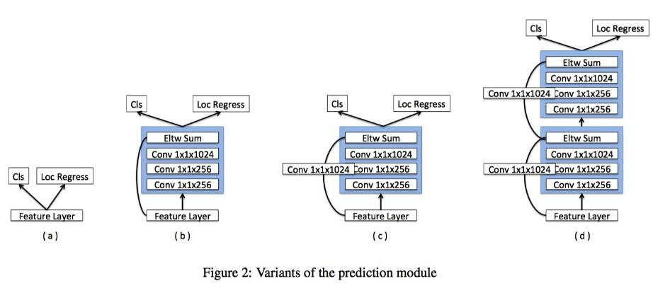
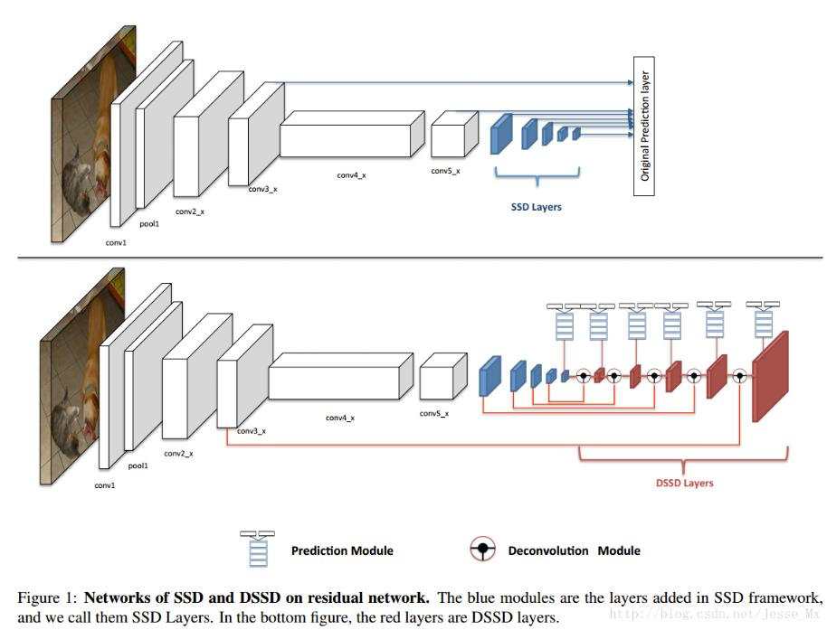
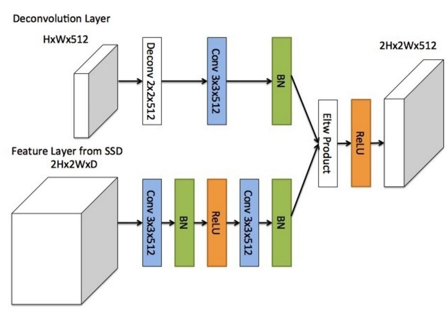

# DSSD : Deconvolutional Single Shot Detector

## Abstract
* 本文的主要贡献在于在当前最好的通用目标检测器中加入了额外的上下文信息。
* 为实现这一目的：我们通过将ResNet-101与SSD结合。然后，我们用deconvolution layers来丰富了SSD + Residual-101，以便在物体检测中引入额外的large-scale的上下文，并提高准确性，特别是对于小物体，从而称之为DSSD。
* 我们通过仔细的加入额外的learned transformations阶段，具体来说是一个用于在deconvolution中前向传递连接的模块，以及一个新的输出模型，使得这个新的方法变得可行，并为之后的研究提供一个潜在的道路。
* 我们的DSSD具有513×513的输入，在VOC2007测试中达到81.5％de的mAP，VOC2012测试为80.0％de的mAP，COCO为33.2％的mAP，在每个数据集上优于最先进的R-FCN 。

## Introduction
* 最近的一些目标检测方法回归到了滑动窗口技术，这种技术随着更强大的整合了深度学习的机器学习框架而回归。
* Faster RCNN -> YOLO -> SSD.
* 回顾最近的这些优秀的目标检测框架，要想提高检测准确率，一个很明显的目标就是：利用更好的特征网络并且添加更多的上下文，特别是对于小物体，另外还要提高边界框预测过程的空间分辨率。
* 在目标检测之外，最近有一个集成上下文的工作，利用所谓的“encoder-decoder”网络。该网络中间的bottleneck layer用于编码关于输入图像的信息，然后逐渐地更大的层将其解码到整个图像的map中。所形成的wide，narrow，wide的网络结构通常被称为沙漏。
* 但是有必要仔细构建用于集成反卷积的组合模块和输出模块，以在训练期间隔绝ResNet-101层，从而允许有效的学习。
* 总结：SSD的直接从数个卷积层中分别引出预测函数，预测量多达7000多，梯度计算量也很大。MS-CNN方法指出，改进每个任务的子网可以提高准确性。根据这一思想，作者在每一个预测层后增加残差模块，并且对于多种方案进行了对比，如下图所示。结果表明，增加残差预测模块后，高分辨率图片的检测精度比原始SSD提升明显。

## Deconvolutional (DSSD) model Single Shot Detection
### Using Residual-101 in place of VGG

将Base Network从VGG16换为ResNet-101并未提升结果，但是添加额外的prediction module会显著地提成性能。

* 在原始SSD中，目标函数直接应用于所选择的特征图，并且由于梯度的大幅度，使用L2标准化层用于conv4 3层。
* MS-CNN指出，改进每个任务的子网可以提高准确性，按照这个原则，我们为每个预测层添加一个残差块，如图2变体（c）所示。
* 我们还尝试了原始SSD方法（a）和具有跳过连接（b）的残余块的版本以及两个顺序的残余块（d）。 我们注意到，ResNet-101和预测模块似乎显著优于对于较高分辨率输入图像没有预测模块的VGG。
* 总结：SSD的直接从数个卷积层中分别引出预测函数，预测量多达7000多，梯度计算量也很大。MS-CNN方法指出，改进每个任务的子网可以提高准确性。根据这一思想，作者在每一个预测层后增加残差模块，并且对于多种方案进行了对比，如下图所示。结果表明，增加残差预测模块后，高分辨率图片的检测精度比原始SSD提升明显。

### Deconvolutional SSD

* 核心思想:如何利用中间层的上下文信息。**方法就是把红色层做反卷积操作，使其和上一级蓝色层尺度相同，再把二者融合在一起，得到的新的红色层用来做预测**。如此反复，仍然形成多尺度检测框架。在图中越往后的红色层分辨率越高，而且包含的上下文信息越丰富，综合在一起，使得检测精度得以提升。
* 为了在检测中包含更多的高层次上下文，我们将prediction module转移到在原始SSD设置之后放置的一系列去卷积层中，有效地制作了非对称沙漏网络结构。
* 添加额外的去卷积层，以连续增加feature maps layers的分辨率。为了加强特征，我们采用了沙漏模型中“跳跃连接”的想法。
* 尽管沙漏模型在编码器和解码器阶段均包含对称层，但由于两个原因，我们使解码器阶段非常浅。
* 总结：为了引入更多的高级上下文信息，作者在SSD+Resnet-101之上，采用反卷积层来进行预测，和原始SSD是不同的，最终形成沙漏形的网络。添加额外的反卷积层以连续增加后面特征图的分辨率，为了加强特征，作者在沙漏形网络中采用了跳步连接（skip connection）方法。按理说，模型在编码和解码阶段应该包含对称的层，但由于两个原因，作者使解码（反卷积）的层比较浅：其一，检测只算是基础目标，还有很多后续任务，因此必须考虑速度，做成对称的那速度就快不起来。其二，目前并没有现成的包含解码（反卷积）的预训练模型，意味着模型必须从零开始学习这一部分，做成对称的则计算成本就太高了。

### Deconvolution Module

* 为了帮助整合早期特征图和去卷积层的信息，我们引入了一个去卷积模块，如图3所示。
* 首先，在每个卷积层之后添加BN层。
* 第二，我们使用学习的去卷积层代替双线性上采样。
* 最后，我们测试不同的组合方法：element-wise sum and element-wise product。
* 总结： 为了整合浅层特征图和反卷积层的信息，作者引入了如figure 3所示的反卷积模块，该模块可以适合整个DSSD架构（figure1 底部实心圆圈）。作者受到论文Learning to Refine Object Segments的启发，认为用于精细网络的反卷积模块的分解结构达到的精度可以和复杂网络一样，并且更有效率。作者对其进行了一定的修改，如Figure 3所示：其一，在每个卷积层后添加批归一化层；其二，使用基于学习的反卷积层而不是简单地双线性上采样；其三，作者测试了不同的结合方式，元素求和（element-wise sum）与元素点积（element-wise product）方式，实验证明点积计算能得到更好的精度。
