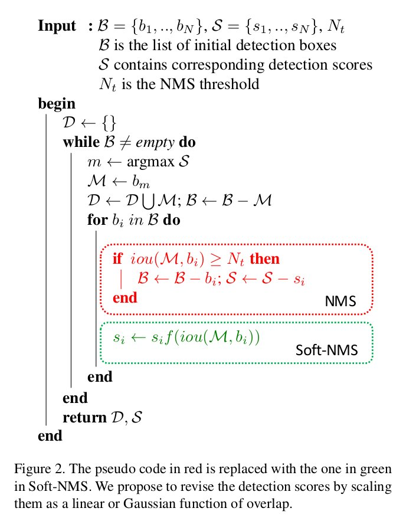

## Main idea

1. Original NMS
$$
s_i=\left\{
\begin{array}{rl}
s_i , \quad \text{iou}(M, b_i ) < N_t \\
0,    \quad \text{iou}(M, b_i ) \geq N_t
\end{array}
\right.
$$
> $M$: a bbox with maximal score
$b_i$: other bboxes
$N_t$: threshold for iou. suppressing all nearby detection boxes with a low $N_t$ would increase the miss-rate (false negtive). Higher $N_t$ causes more false positives.

2. Linerly Soft-NMS
$$
s_i=\left\{
\begin{array}{rl}
s_i, \qquad \qquad\qquad\qquad  \text{iou}(M, b_i ) < N_t  \\
s_i(1-\text{iou}(M,b_i)), \quad \text{iou}(M, b_i ) \geq N_t
\end{array}
\right.
$$

3. Gaussian Soft-NMS
$$
s_i=s_ie^{-\frac{\text{iou}(M,b_i)^2}{\sigma}}, \quad \forall b_i\notin D
$$

## Author's implementation

```python
def cpu_soft_nms(np.ndarray[float, ndim=2] boxes, float sigma=0.5, float Nt=0.3, float threshold=0.001, unsigned int method=0):
    cdef unsigned int N = boxes.shape[0]
    cdef float iw, ih, box_area
    cdef float ua
    cdef int pos = 0
    cdef float maxscore = 0
    cdef int maxpos = 0
    cdef float x1,x2,y1,y2,tx1,tx2,ty1,ty2,ts,area,weight,ov

    for i in range(N):
        maxscore = boxes[i, 4]
        maxpos = i

        tx1 = boxes[i,0]
        ty1 = boxes[i,1]
        tx2 = boxes[i,2]
        ty2 = boxes[i,3]
        ts = boxes[i,4]

        pos = i + 1
        # get max box
        while pos < N:
            if maxscore < boxes[pos, 4]:
                maxscore = boxes[pos, 4]
                maxpos = pos
            pos = pos + 1

        # add max box as a detection
        boxes[i,0] = boxes[maxpos,0]
        boxes[i,1] = boxes[maxpos,1]
        boxes[i,2] = boxes[maxpos,2]
        boxes[i,3] = boxes[maxpos,3]
        boxes[i,4] = boxes[maxpos,4]

        # swap ith box with position of max box
        boxes[maxpos,0] = tx1
        boxes[maxpos,1] = ty1
        boxes[maxpos,2] = tx2
        boxes[maxpos,3] = ty2
        boxes[maxpos,4] = ts

        tx1 = boxes[i,0]
        ty1 = boxes[i,1]
        tx2 = boxes[i,2]
        ty2 = boxes[i,3]
        ts = boxes[i,4]

        pos = i + 1
        # NMS iterations, note that N changes if detection boxes fall below threshold
        while pos < N:
            x1 = boxes[pos, 0]
            y1 = boxes[pos, 1]
            x2 = boxes[pos, 2]
            y2 = boxes[pos, 3]
            s = boxes[pos, 4]

            area = (x2 - x1 + 1) * (y2 - y1 + 1)
            iw = (min(tx2, x2) - max(tx1, x1) + 1)
            if iw > 0:
                ih = (min(ty2, y2) - max(ty1, y1) + 1)
                if ih > 0:
                    ua = float((tx2 - tx1 + 1) * (ty2 - ty1 + 1) + area - iw * ih)
                    ov = iw * ih / ua #iou between max box and detection box

                    if method == 1: # linear
                        if ov > Nt:
                            weight = 1 - ov
                        else:
                            weight = 1
                    elif method == 2: # gaussian
                        weight = np.exp(-(ov * ov)/sigma)
                    else: # original NMS
                        if ov > Nt:
                            weight = 0
                        else:
                            weight = 1

                    boxes[pos, 4] = weight*boxes[pos, 4]

                    # if box score falls below threshold, discard the box by swapping with last box
                    # update N
                    if boxes[pos, 4] < threshold:
                        boxes[pos,0] = boxes[N-1, 0]
                        boxes[pos,1] = boxes[N-1, 1]
                        boxes[pos,2] = boxes[N-1, 2]
                        boxes[pos,3] = boxes[N-1, 3]
                        boxes[pos,4] = boxes[N-1, 4]
                        N = N - 1
                        pos = pos - 1

            pos = pos + 1

    keep = [i for i in range(N)]

    return keep
```

## Fast NMS in caffe

### detection_output.cpp

```cpp
ApplyNMSFast(bboxes, scores, confidence_threshold_, nms_threshold_, eta_,
    top_k_, &(indices[c])); //.cpp
ApplyNMSFast(cur_bbox_data, cur_conf_data, num_priors_,
    confidence_threshold_, nms_threshold_, eta_, top_k_, &(indices[c])); //.cu
```

* 解读 `Forward_cpu`
1. 一些常量
`num_loc_classes_ = share_location_ ? 1 : num_classes_;` 如果shared表示所有的类别同用一个location prediction，否则每一类各自预测
`const int num = bottom[0]->num();` batch size
`num_priors_ = bottom[2]->height() / 4;` 先验的个数，每个先验包含左上角和右下角的点坐标

2. 把所有预测的box写入了`all_loc_preds`，这些box就是`bottom[0]`，`loc_data`
```cpp
vector<LabelBBox> all_loc_preds; // map<int, vector<NormalizedBBox> > LabelBBox;
GetLocPredictions(loc_data, num, num_priors_, num_loc_classes_,
                  share_location_, &all_loc_preds);
```

3. 获得置信度信息
```cpp
vector<map<int, vector<float> > > all_conf_scores;
GetConfidenceScores(conf_data, num, num_priors_, num_classes_,
                    &all_conf_scores);

```

4. 获得先验bbox
```cpp
vector<NormalizedBBox> prior_bboxes;
vector<vector<float> > prior_variances;
GetPriorBBoxes(prior_data, num_priors_, &prior_bboxes, &prior_variances);
```

5. 解码上面的信息，利用`all_loc_preds, prior_bboxes, prior_variances`获得`all_decode_bboxes`

6. 针对batch中第i个图片，从`all_decode_bboxes`获得它的`decode_bboxes (LableBBox)`和`conf_score (map<int, vector<float> >)`

7. 创建一个索引`indices (map<int, vector<int> >)` 用于保存某个类别下(`int`)哪几个bbox需要保留(` vector<int>`)

8. 针对某一个类别`c`, 得到检测结果的`scores (vector<float>)`
> stl::map 的用法 [map](http://mropengate.blogspot.jp/2015/12/cc-map-stl.html)

9. 如果`share_location_=True` 找到所有的bbox (`vector<NormalizedBBox>`)，如果`share_location_=False` 找到该类别的的bbox。**用于NMS**

10. 执行NMS，保留的bbox的索引放在$indices[c]$中

11. 对所有类别操作结束后得到最终bbox的数量`num_det`，只保留`keep_top_k_`个目标

12. 后续代码关于bbox的reshape，输出显示，以及caffe的数据传输


### bbox_util.cpp
NMS解读
```cpp
template <typename Dtype>
void ApplyNMSFast(const Dtype* bboxes, const Dtype* scores, const int num,
      const float score_threshold, const float nms_threshold,
      const float eta, const int top_k, vector<int>* indices) {
  // Get top_k scores (with corresponding indices).
  vector<pair<Dtype, int> > score_index_vec;
  GetMaxScoreIndex(scores, num, score_threshold, top_k, &score_index_vec); //得到按score的排序以及索引

  // Do nms.
  float adaptive_threshold = nms_threshold;
  indices->clear();
  while (score_index_vec.size() != 0) {
    const int idx = score_index_vec.front().second  //取第一个元素
    bool keep = true;
    for (int k = 0; k < indices->size(); ++k) {  //与每一个已有的bbox算overlap
      if (keep) {
        const int kept_idx = (*indices)[k];
        float overlap = JaccardOverlap(bboxes + idx * 4, bboxes + kept_idx * 4);
        keep = overlap <= adaptive_threshold;
      } else {
        break;  // 若与任一个已有bbox的overlap超标，则丢弃
      }
    }
    if (keep) {
      indices->push_back(idx);
    }
    score_index_vec.erase(score_index_vec.begin());  //擦除第一个元素
    if (keep && eta < 1 && adaptive_threshold > 0.5) {
      adaptive_threshold *= eta;
    }
  }
}
```

## My implementation
```cpp
template <typename Dtype>
void ApplySoftNMSFast(const Dtype* bboxes, const Dtype* scores, const int num,
      const float score_threshold, const float nms_threshold_down,
      const float nms_threshold_up, const int top_k, vector<int>* indices) {
  // Get top_k scores (with corresponding indices).
  vector<pair<Dtype, int> > score_index_vec;
  GetMaxScoreIndex(scores, num, score_threshold, top_k, &score_index_vec);
  // Do soft nms.
  indices->clear();
  while (score_index_vec.size() != 0) {
    const int idx = score_index_vec.front().second;
    bool keep = true;
    for (int k = 0; k < indices->size(); ++k) {
      if (keep) {
        const int kept_idx = (*indices)[k];
        float overlap = JaccardOverlap(bboxes + idx * 4, bboxes + kept_idx * 4);
        keep = (overlap <= nms_threshold_down) || ((overlap <= nms_threshold_up)
            && (exp(-(overlap*overlap)/0.5)*score_index_vec.front().first >= score_threshold));
      } else {
        break;
      }
    }
    if (keep) {
      indices->push_back(idx);
    }
    score_index_vec.erase(score_index_vec.begin());
  }
}
```

* 修改记录
1. `bbox.cpp`: 添加以上代码并添加`ApplySoftNMSFast`的template
2. `bbox.hpp`: 添加`ApplySoftNMSFast`的申明
3. `detection_output_layer.cu`: 相应部分(72行左右)改为
```cpp
if (eta_==1){
  ApplyNMSFast(cur_bbox_data, cur_conf_data, num_priors_,
    confidence_threshold_, nms_threshold_, eta_, top_k_, &(indices[c]));
  }
else{
  ApplySoftNMSFast(cur_bbox_data, cur_conf_data, num_priors_,
      confidence_threshold_, eta_, nms_threshold_
    , top_k_, &(indices[c]));
  }
```

* 注意事项
1. 在原`ApplyNMSFast`中， `eta`用于自适应`nms_threshold`的计算
2. 在`ApplySoftNMSFast`中，`eta`用于指示上限阈值。与标准的Soft-NMS不同的是，这里采用双阈值`nms_threshold_up`和`nms_threshold_down`。当`overlap>nms_threshold_up`,完全抑制；当`overlap<=nms_threshold_down`,完全不抑制；当`overlap`处于中间时，用高斯加权方法重新计算`score`
3. `eta`,`confidence_threshold`需要在`deploy.prototxt`中谨慎定义。若不定义`eta`，默认为`1`.

* 未解决的问题
1. 高斯参数不能动态修改
2. 判断时重新计算了`score`但未真正重新赋值
3. Soft-NMS会稍降低运行速度；若参数不合理，会大大增加false positive
