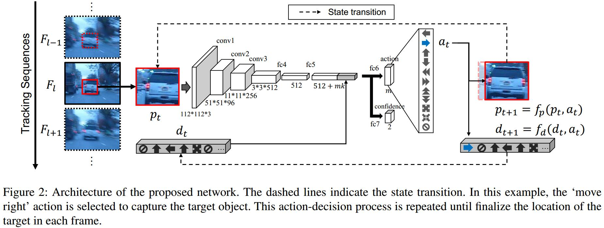

# Action-Decision Networks for Visual Tracking with Deep Reinforcement Learning
[cv](http://openaccess.thecvf.com/content_cvpr_2017/papers/Yun_Action-Decision_Networks_for_CVPR_2017_paper.pdf)
[TOC]
## Introduction
1. supervised learning: train our network to select actions to track the position of the target using samples extracted from training videos
2. reinforcement learning: perform RL via tracking simulation using training sequences composed of sampled states, actions, and rewards.

## Method

1. Markov Decision Process (MDP)
   1. states $s_{t,l}\in \mathcal S$ for $t = 1, ..., T_l$ and $l = 1, ..., L$
      1. including appearance information at the bounding box of the target and the previous actions
      2. where $T_l$ is the terminal step at frame $l$ and $L$ denotes the number of frames in a video.
      3. The terminal state in the $l$-th frame is transferred to the next frame, i.e., $s_{1,l+1} := s_{Tl,l}$

   2. action $a_{t,l} \in \mathcal A$
   3. transition function $s'=f(s,a)$
   4. reward $r(s,a)$
   deciding whether the agent succeed to track the object or not
2. Action
    1. $\{left, right, up, down, left\times2, right\times2, up\times2, down\times2, scale up,scale down,stop\}$
    2. 11-dimensional vector with one-hot forms
3. State
   1. $s_t=(p_t,d_t)$
   2. $p_t\in \mathbb R^{112\times112\times3}$ the image patch within the bounding box
   3. $d_t\in\mathbb R^{110}$ the dynamics of actions denoted by a vector (action dynamics vector), containing the previous $k$ actions at $t$-th iteration
   4. $p_t=\phi(b_t,F), b_t=[x^{(t)},y^{(t)},w^{(t)},h^{(t)}]$, $F$ is a frame image
   5. $\phi$ denotes the pre-processing function which crops the patch $p_t$ from $F$ at $b_t$ and resizes it to match the input size of our network.
   > $p_t$就是把目标区域crop出来，然后resize

   6. $d_t=[\psi(a_{t-1}),...,\psi(a_{t-k})]$, where $\psi$ denotes one-hot encoding function
   > $d_t$ 保存最近$k$个action，每个action是11维的one hot

4. State transition function
    1. patch transition function, $b_{t+1} = f_p(b_t, a_t)$
       1. $\Delta x(t) = \alpha w(t) \qquad \Delta y(t) = \alpha h(t) \qquad \alpha=0.03 $
       2. left: $[x^{(t)}-\Delta x^{(t)}, y^{(t)}, w^{(t)}, h^{(t)}]$
       3. scale up: $[x^{(t)}, y^{(t)}, w^{(t)}+\Delta x^{(t)}, h^{(t)}+\Delta y^{(t)}]$
    2. action dynamics function, which represent the transition of action history $d_{t+1} = f_d(d_t, a_t)$
5. Reward
    1. reward $r(s_t)$ keeps zero during iteration in MDP in a frame. When the $stop$ action is selected, the agent will receive the reward
    $$
    r(s_T)= 1 \quad \text{if} \quad  IOU(b_T,G)>0.7 \quad \text{else} \quad -1
    $$
    2. tracking score $z_t=r(s_T)$

## Training
The ADNet is pretrained by supervised learning as well as reinforcement learning. During actual tracking, online adaptation is conducted.

## reference

### KCF
[13] J. F. Henriques, R. Caseiro, P. Martins, and J. Batista. Highspeed tracking with kernelized correlation filters. IEEE Transactions on Pattern Analysis and Machine Intelligence, 37(3):583–596, 2015.

### deep convolutional with correlation filters
[8] M. Danelljan, G. Hager, F. Shahbaz Khan, and M. Felsberg. Convolutional features for correlation filter based visual tracking. In Proceedings ofthe IEEE International Conference on Computer Vision Workshops, pages 58–66, 2015. 2, 7, 8
[9] M. Danelljan, A. Robinson, F. Shahbaz Khan, and M. Felsberg. Beyond correlation filters: Learning continuous convolution operators for visual tracking. In ECCV, 2016.

### RL
[30] R. S. Sutton. Introduction to reinforcement learning, volume 135.
[27] D. Silver, A. Huang, C. J. Maddison, A. Guez, L. Sifre, G. Van Den Driessche, J. Schrittwieser, I. Antonoglou, V. Panneershelvam, M. Lanctot, et al. Mastering the game of go with deep neural networks and tree search. Nature, 529(7587):484–489, 2016.
[28] D. Silver, G. Lever, N. Heess, T. Degris, D. Wierstra, and M. Riedmiller. Deterministic policy gradient algorithms. In ICML, 2014. 2, 3
> DPG

[32] H. Van Hasselt, A. Guez, and D. Silver. Deep reinforcement learning with double q-learning. CoRR, abs/1509.06461, 2015.
> Double DQN

[37] Z. Wang, N. de Freitas, and M. Lanctot. Dueling network architectures for deep reinforcement learning. arXiv preprint arXiv:1511.06581, 2015.
> DDQN

[38] R. J. Williams. Simple statistical gradient-following algorithms for connectionist reinforcement learning. Machine learning, 8(3-4):229–256, 1992.
> policy gradient

[3] J. C. Caicedo and S. Lazebnik. Active object localization with deep reinforcement learning. In Proceedings of the IEEE International Conference on Computer Vision, pages 2488–2496, 2015.
> object localization

[16] D. Jayaraman and K. Grauman. Look-ahead before you leap: end-to-end active recognition by forecasting the effect ofmotion. arXiv preprint arXiv:1605.00164, 2016.
> action recognition

### VGG-M
[4] K. Chatfield, K. Simonyan, A. Vedaldi, and A. Zisserman. Return of the devil in the details: Delving deep into convolutional nets. arXiv preprint arXiv:1405.3531, 2014.

## Learned
帧内使用强化学习思想，再用网络将本帧的action和下帧的特征结合在一起共同回归出下帧的action
