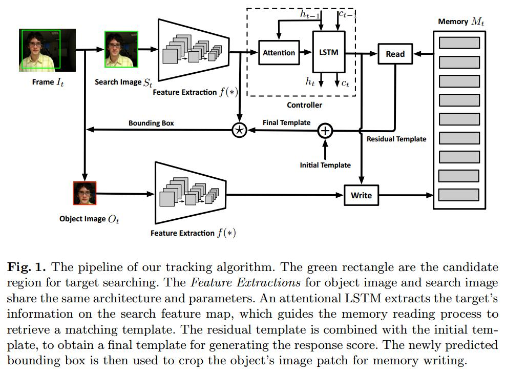

# Learning Dynamic Memory Networks for Object Tracking
[arXiv](https://arxiv.org/abs/1803.07268)
[TOC]

## Introduction
1. two dominant tracking strategies
   1. tracking-by-detection: online trains an object appearance classifier [1, 2]
   2. template matching: adopts either the target patch in the first frame [4,6] or the previous frame [7] to construct the matching model
   3. different:
      1. tracking-by-detection maintains the target’s appearance information in the weights of the deep neural network, thus requiring online fine-tuning with stochastic gradient descent (SGD) to make the model adaptable
      > tracking-by-detection 需要在线调整参数；速度慢，精度高

      2. template matching stores the target’s appearance in the object template, which is generated by a feed forward computation.
      > template matching 保存一个模板，只需要前向计算；速度快

2. Recently, several trackers [4, 5, 10] adopt fully convolutional Siamese networks as the matching model
> 采用全卷积Siamese networks作为匹配模板

3. In this paper
   1. 记忆在外部储存和召回(external memory block)
   2. use the initial template as a conservative reference of the object and a **residual template**
   3. the residual template is gated channel-wise and combined with the initial template to form the final matching template
   4. LSTM用于控制外部记忆的读写
   5. 初始目标未知，用attention初定位

## Approach

1. Feature Extraction
   1. 用之前的bbox crop一个$S_t$
   2. SiamFC[4]作为提取网络。全图提特征和bbox提特征共享参数
2. Attention Scheme
   1. $f^* (S_t) = \text{AvePooling}_{n\times n}(f(S_t))$
   2. $f_{t,i}^* \in \mathbb R^c$ 是第$i$个patch的特征向量，总共$L$个
   3. attended feature vector $$ a_t = \sum_{i=1}^L\alpha_{t,i}f_{t,i}^* $$
   4. attention weights
   $$ \alpha_{t,i}=\frac{\exp(r_{t,i})}{\sum_{k=1}^L\exp(r_{t,k})} $$
   $r_{t,i}$ 是由$h_{t-1},f_{t,i}^* $经线性层算出
3. LSTM Memory Controller
   1. 输入$a_t,h_t-1$
   2. 输出$h_t$
   3. 门: read key, read strength, bias gates, and decay rate
4. Memory Reading    
   1. read key $k_t$: 匹配记忆中的内容
   2. read strength $\beta_t$：指示read key的可靠性
   3. read weight $w_t^r$：由read key和read strength计算
   4. retrieved template：$T_t^{retr}=\sum_{j=1}^N w_t^r(j)M_T(j)$
5.  Residual Template Learning
    1. 避免$T$过拟合于最近的帧
    2. $T_t^{final}=T_0+r_t\odot T_t^{retr}$
    > $T_0$为初始值, $\odot$为channel-wise multiplication

    3. residual gate: $r_t$, 由$h_t$线性计算

## Reference
[1]. Song, Y., Ma, C., Gong, L., Zhang, J., Lau, R., Yang, M.H.: CREST: Convolutional
Residual Learning for Visual Tracking. In: ICCV. (2017)
[2]. Nam, H., Han, B.: Learning Multi-Domain Convolutional Neural Networks for
Visual Tracking. In: CVPR. (2016)
[4]. Bertinetto, L., Valmadre, J., Henriques, J.F., Vedaldi, A., Torr, P.H.S.: FullyConvolutional Siamese Networks for Object Tracking. In: ECCVW. (2016)
> Siamese networks (SiamFC)

[5]. Guo, Q., Feng, W., Zhou, C., Huang, R., Wan, L., Wang, S.: Learning Dynamic Siamese Network for Visual Object Tracking. In: ICCV. (2017)
[6]. Tao, R., Gavves, E., Smeulders, A.W.M.: Siamese Instance Search for Tracking. In: CVPR. (2016)
[7]. Held, D., Thrun, S., Savarese, S.: Learning to Track at 100 FPS with Deep Regression Networks. In: ECCV. (2016)
[10]. Yang, T., Chan, A.B.: Recurrent Filter Learning for Visual Tracking. In: ICCVW. (2017)
> RFL (Recurrent Filter Learning) tracker, using ConvLSTM

[11]. Huang, C., Lucey, S., Ramanan, D.: Learning Policies for Adaptive Tracking with
Deep Feature Cascades. In: ICCV. (2017)
