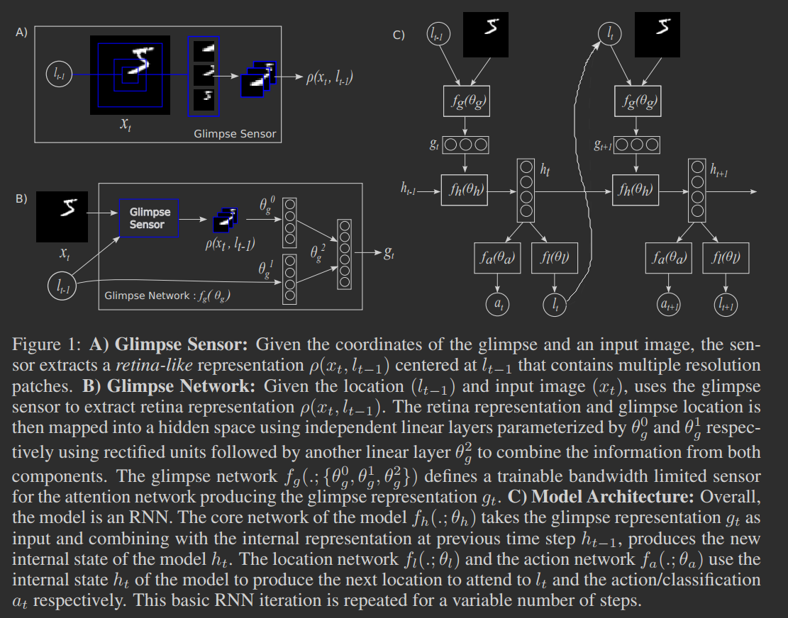

# Recurrent Models of Visual Attention
[arXiv](https://arxiv.org/abs/1406.6247)

## Introduction
1. the model selects the next location to attend to based on past information and the demands of the task

## Method

### model
1. Glimpse Sensor: At each step $t$, sensor extracts a retina-like representation $\rho (x_t;l_{t-1})$ around location $l_{t-1}$ from image $x_t$
> 以$l_{t-1}$为中心得到一系列不同分辨率的图像$x_t$ (glimpse)

2.  Glimpse network $f_g$: to produce the glimpse feature vector $g_t = f_g(x_t; l_{t-1}; \theta_g)$ where $\theta_g = \{\theta_g^0;\theta_g^1;\theta_g^2\}$
> 产生 glimpse feature vector

3. Internal state: summarizes information extracted from the history of past observations; is instrumental to deciding how to act and where to deploy the sensor. This internal state is formed by the hidden units $h_t$ of the recurrent neural network and updated over time by the core network: $h_t = f_h(h_{t-1}; g_t; \theta_h)$.
> 总结历史信息，有助于act和部署sensor。它就是RNN的隐状态，根据$t-1$的隐状态和$t$的glimpse feature vector来更新

4. Action:
   1. location action $l_t$: how to deploy its sensor 定位
   2. environment action $a_t$: might affect the state of the environment 分类
> 可看做定位和分类

5. Reward: In the case of object recognition,$r_T=1$ if the object is classified correctly after $T$ steps and $0$ otherwise. $R = \sum_{t=1}^T r_t$

### training
$r_T=1$ if the object is classified correctly after T steps and 0 otherwise
$$
J(\theta)=\mathbb E_{p(s_{1:T};\theta)}[\sum_{t=1}^Tr_t]=\mathbb E_{p(s_{1:T};\theta)}[R]
$$
> 只有当最后一步分类正确时$r_T=1$，其余为0。$J$是奖励函数，$s_i$是序列，$p$ depends on policy

$$
\triangledown_\theta J \approx \sum_{t=1}^TE_{p(s_{1:T};\theta)}[\triangledown_\theta \log\pi(u_t|s_{1:t};\theta)R]=\frac{1}{M}\sum_{i=1}^M\sum_{t=1}^T\triangledown_\theta \log\pi(u_t^i|s^i_{1:t};\theta)R^i
$$
> 梯度的无偏估计unbiased estimate[26]。M是回合数(episodes)

为了减小Variance
$$
\triangledown_\theta J \approx \frac{1}{M}\sum_{i=1}^M\sum_{t=1}^T\triangledown_\theta \log\pi(u_t^i|s^i_{1:t};\theta)(R^i_t-b_t)
$$
> $R_t^i=\sum_{t'=1}^Tr_{t'}^i$是累积奖励(cumulative reward)
  $b_t$ is a baseline that may depend on $s^i_{1:t}$ (e.g. via $h^i_t$) but not on the action $u^i_t$ itself。这里选择$b_t=\mathbb E\pi[R_t]$[21]

## Reference
[26] R.J. Williams. Simple statistical gradient-following algorithms for connectionist reinforcement learning. Machine Learning, 8(3):229–256, 1992.
[25] Daan Wierstra, Alexander Foerster, Jan Peters, and Juergen Schmidhuber. Solving deep memory pomdps with recurrent policy gradients. In ICANN. 2007.
[21] Richard S. Sutton, David Mcallester, Satinder Singh, and Yishay Mansour. Policy gradient methods for reinforcement learning with function approximation. In NIPS, pages 1057–1063. MIT Press, 2000.

## Learned
这个思路和检测很相似。针对单张图片，这篇文章不直接提取全图特征，而是多次迭代，选择一个合适位置提取局部特征，减小的计算量，也可避免干扰。在视频检测中，可根据历史信息估计可能出现的object的位置，这样既可增加定位精度，又可给出id
