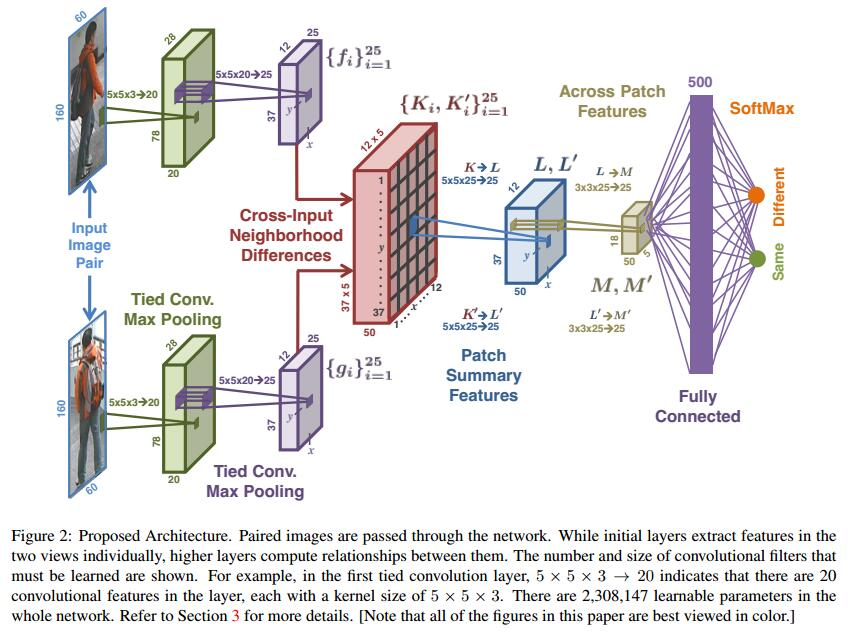

# An Improved Deep Learning Architecture for Person Re-Identification
[cv](https://www.cv-foundation.org/openaccess/content_cvpr_2015/papers/Ahmed_An_Improved_Deep_2015_CVPR_paper.pdf)
[TOC]
## Introduction
1. Re-id=  extracting features +  a metric for comparing those features

## Appraoch

1. Tied Convolution: 两层conv+maxpooling提取特征
2. Cross-Input Neighborhood Differences (这是最关键的部分)
   用一张图上$(x,y)$，减去另一张图对应$(x-2,x+2)$,$(y-2,y+2)$这个临近区域每一个像素值可以得到$5\times 5$个值。如果上面一张中层特征图我们称为$f$，下面我们称为$g$。那么$f-g$的话有25张扩大了$5\times 5$倍的图，对应的用$g-f$也有25张$5\times 5$的图。
3. Patch Summary Features: conv,需要注意的是这里两个25张图, 用的是不同weight的conv
4. Across-Patch Features:
