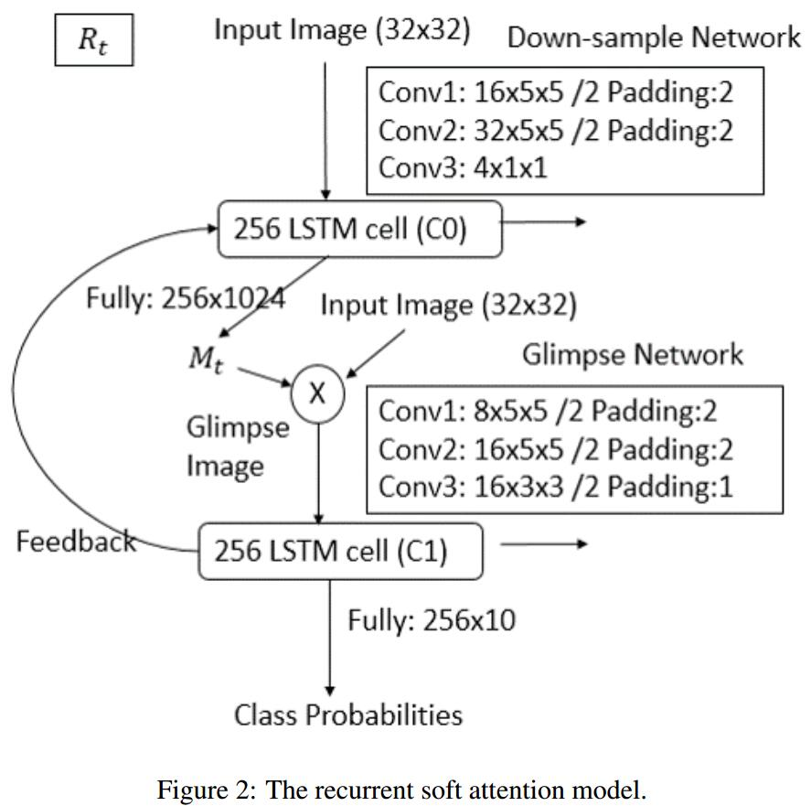

# Recurrent Soft Attention Model for Common Object Recognition
[arXiv](https://arxiv.org/abs/1705.01921)

1. $R_t$ (0<t<N): glimpse timestamp
> $N$: The total number of glimpse 进行多少次glimpse

2. decode the visual attention from the hidden units in the LSTM cell through a fully-connected layer with the ReLu activation function, and obtain mask matrix $M_t$ from the LSTM cell (C0)
> 从C0得到mask，也就是attention。用ReLU

3. $M_t$ is used for generating the glimpse image by multiplying the input image pixel matrix element-wisely
> $M_t$ 和原图相乘得到glimpse image. ReLU导致了大量的0, $M_t$中不为0的部分就是attenetion information

4. the hidden units of the LSTM cell (C1) is inputted to the LSTM cell (C0) as a feedback to provide the glimpse information needed for the memory units inside C0 to conduct the next attention extraction process.
> C1接收glimpse image进行分类，然后因状态返回C0进行下一次glimpse
