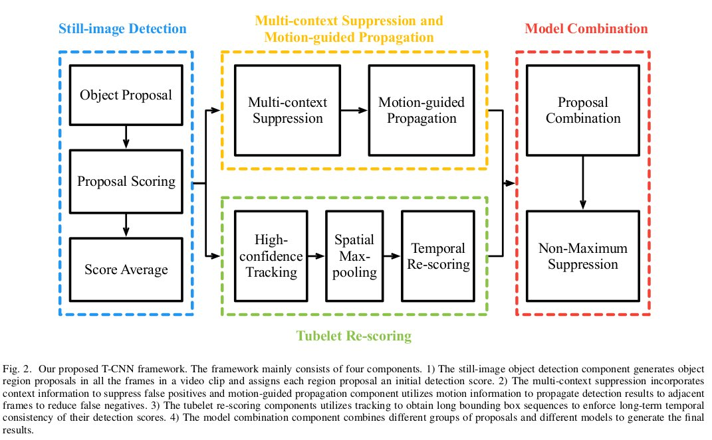

# T-CNN: Tubelets with Convolutional Neural Networks for Object Detection from Videos
[arXiv](https://arxiv.org/abs/1604.02532)

[TOC]

## Introduction
1. Key elements of video: **temporal information**, **contextual information**
2. Key for video detection:
    1. improve temporal consistency
        1. propagate detection results to neighbor frames to reduce sudden changes of detection results.
        2. impose long-term constraints on the detection results. A tubelet generated by tracking and spatio-temporal object proposal algorithms $[9]$ can be treated as a unit to apply the long-term constraint.
    2. contextual information is also a key element of videos

> 时序信息：用来保持同一object在时序上的confidence (针对true positives)
上下文信息：用来抑制false positives (可能某些帧里有high confidence false positives)

## Contributions
1. We propose a deep learning framework that extends popular still-image detection frameworks (R-CNN and Faster R-CNN) to solve the problem of general object detection in videos by incorporating temporal and contextual information from tubelets. It is called T-CNN, i.e. tubelets with convolution neural network.
> 扩展RCNN到视频领域，提出TCNN，包含了时序信息和上下文信息

2. Temporal information is effectively incorporated into the proposed detection framework by locally propagating detection results across adjacent frames as well as globally revising detection confidences along tubelets generated from tracking algorithms.
> 时序信息用来在相邻帧局部地传播检测结果，并通过跟踪产生的tubelets全局修正confidence

3. Contextual information is utilized to suppress detection scores of low-confidence classes based on all detection results within a video clip.
> 上下文信息用来抑制低confidence的检测

## Methods
1. Overview

2. Still-image object detectors
   1. DeepID-Net $[8]$
   2. CRAFT $[44]$.
3. Multi-context suppression (MCS)
   + reducing false positive detections.
   1. rank all detection scores on all boxes in a descending order
   2. The MCS selects the top classes based on the ranking of box scores and punishes the unlikely classes because of the lower possibility of a large number of classes being in the same video.
> The MCS is not suitable for the dataset multi-classes in each frame
> 按score降序排序，较高的类别为high-confidence类，对应也有low-confidence，而这些low-confidence的检测得分被抑制
> 适用于针对一个视频段不太可能有太多类物体的情况

4. Motion-guided propagation (MGP)
   * reducing false negatives. short-term temporal constraints and consistency to the final detection results.
   * The false negatives are typically caused by several reasons: 1) There are no region proposals covering enough areas of the objects; 2) Due to bad pose or motion blur of an object, its detection scores are low.
   > 1. 没有region proposals 2. 得分低

   * calculate the mean optical flow vector within the bounding box of the region proposal and propagate the box coordinates with same detection scores to adjacent frames according the mean flow vectors.

> 避免不稳定检测,利用运动信息，例如光流。解决short-term temporal问题

5. Temporal tubelet re-scoring

    1. High-confidence tracking
       * track high-confidence detection proposals bidirectionally over the temporal dimension $[42]$
       1. Starting from an anchor, we track biredictionally to obtain a complete tubelet, which will stop when low tracking confidence occurs.
       2. Detections that have overlaps with the existing tracks beyond a certain threshold (IOU, i.e. Intersection of Union, 0.3 in our experiment) will not be chosen as new anchors.
       > 跟踪产生tubelets，当tracking confidence<0.1停止。为减少冗余，检测框和现有的tubelets的overlap超过0.3的不能用于实施新的跟踪

    6. Spatial max-pooling
       * replace tubelet box proposals with detections of higher confidence by the still-image object detector
       1. obtain the detections from still-image object detectors that have overlaps with the tubelet box beyond a threshold (IOU 0.5 in our setting).
       2. only the detection with the maximum detection score is kept and used to replace the tracked bounding box.
       > 既考虑tubelet box 也考虑detection box。如果对跟踪框分类，结果不一定准确，且跟踪也不一定准确。spatial max-pooling：用高分检测框代替跟踪框

    7. Tubelet classification and rescoring
       * The main idea of temporal rescoring is to classify tubelets into positive and negative samples and map the detection scores into different ranges to increase the score margins.
       1. 1-D Bayesian classifier is trained to classify the tubelets for re-scoring.
       2. the detection scores of positive samples are min-max mapped to $[0.5, 1]$, while negatives to $[0, 0.5]$. Thus, the tubelet detection scores are globally changed so that the margins between positive and negative tubelets are increased.
> 用跟踪算法产生tubelets，放大高score，抑制低score，增大socre margines。解决long-term temporal问题

## References
### context information
$[8]$ W. Ouyang, X. Wang, X. Zeng, S. Qiu, P. Luo, Y. Tian, H. Li, S. Yang, Z. Wang, C.-C. Loy et al., “DeepID-net: Deformable deep convolutional neural networks for object detection,” CVPR, 2015.

### spatio-temporal object proposal
$[9]$ D. Oneata, J. Revaud, J. Verbeek, and C. Schmid, “Spatio-temporal
Object Detection Proposals,” ECCV, 2014.

### closed-loop object detection
[21] L. Galteri, L. Seidenari, M. Bertini, and A. Del Bimbo, “Spatio-temporal
closed-loop object detection,” IEEE Transactions on Image Processing, 2017.

### track
$[42]$ L. Wang, W. Ouyang, X. Wang, and H. Lu, “Visual tracking with fully
convolutional networks,” ICCV, 2015.

### CRAFT
$[44]$ B. Yang, J. Yan, Z. Lei, and S. Z. Li, “Craft objects from images,”
CVPR, 2016.

## Learned
太多后处理，用光流、跟踪方法产生tubelet，增加了许多信息冗余。而且抑制非最大类的方法完全只针对VID数据集，不能推广
