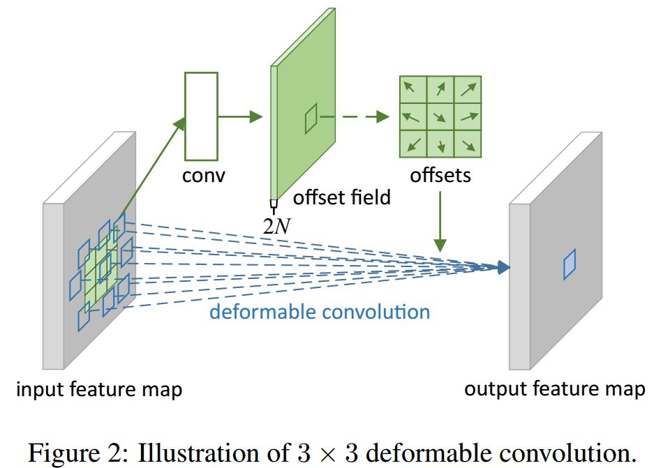

# Deformable Convolutional Networks
[arXiv](https://arxiv.org/abs/1703.06211)
[Medium](https://medium.com/@phelixlau/notes-on-deformable-convolutional-networks-baaabbc11cf3)
[pytorch](https://github.com/oeway/pytorch-deform-conv)
[another_pytorch](https://github.com/1zb/deformable-convolution-pytorch)
[MXNet](https://github.com/msracver/Deformable-ConvNets)
[Zhihu](https://www.zhihu.com/question/57493889/answer/165287530)
[Translation](http://noahsnail.com/2017/11/29/2017-11-29-Deformable%20Convolutional%20Networks%E8%AE%BA%E6%96%87%E7%BF%BB%E8%AF%91%E2%80%94%E2%80%94%E4%B8%AD%E8%8B%B1%E6%96%87%E5%AF%B9%E7%85%A7/)

## Introduction
1. 如何解决样本几何的变化(geometric transformations in object scale, pose, viewpoint, and part deformation)
   1. 足够的数据，数据扩增
   2. 用transformation-invariant features and algorithms， e.g., SIFT(scale invariant feature transform)
2. CNN同样存在以上问题

## Deformable Convolution
1. 2D connvolution
   1. 用一个规则的网格$\mathcal R$进行采样
   2. 与对应权值相乘相加
   $$y(p_0)=\sum_{p_n\in\mathcal R}w(p_n)\cdot x(p_0+p_n)$$
   
2. deformable convolution
   1. $\mathcal R$用一个偏移量来扩增
   $$y(p_0)=\sum_{p_n\in\mathcal R}w(p_n)\cdot x(p_0+p_n+\Delta p_n)$$
   > $\Delta p_n$是小数

   2. 双线性插值来获得任意位置的值
   $$ x(p)=\sum_qG(q,p)\cdot x(q) $$
   > $p=p_0+p_n+\Delta p_n$, $q$是所有的整数位置

   3. 偏移由该feature map经过卷积获得

## Deformable RoI Pooling
1. ROI pooling: converts an input rectangular region of arbitrary size into fixed size features.
   1. 输入: feature map, RoI($w\times h, p_0$为左上角)
   2. 将RoI分为$k\times k$个窗口(bin)
   3. 输出: $k\times k$ feature map $y$
   $$ y(i,j)=\sum_{p\in bin(i,j)}x(p_0+p)/n_{i,j} $$
   > $n$是bin里的总像素个数
   第$(i,j)$个bin的范围是(The $(i,j)$-th bin spans):
   $floor(i\frac{w}{k})\leq p_x\leq ceil((i+1)\frac{w}{k})$和$floor(i\frac{h}{k})\leq p_y\leq ceil((i+1)\frac{h}{k})$

2. deformable RoI pooling
   1. bin内部的偏移
   $$ y(i,j)=\sum_{p\in bin(i,j)}x(p_0+p+\Delta p_{i,j})/n_{i,j} $$
   > p_{i,j}也是小数

   2. 偏移的生成
      1. RoI pooling+fc 产生一个归一化的偏移 $\Delta\hat p_{i,j}$
      2. 设定一个尺度$\gamma = 0.1$来调节偏移的量级
      $$ p_{i,j} = \gamma\Delta\hat p_{i,j}\circ (w,h) $$
