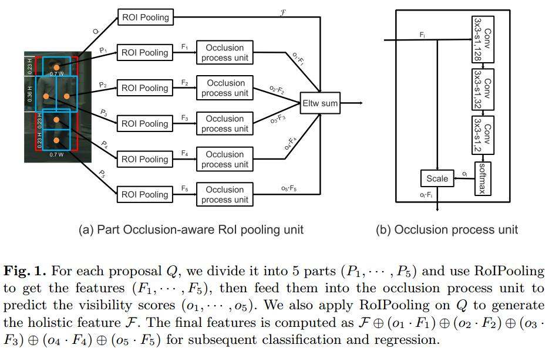

# Occlusion-aware R-CNN: Detecting Pedestrians in a Crowd
[arXiv](https://arxiv.org/abs/1807.08407)

## Introduction
1.  aggregation loss (AggLoss): not only to enforce proposals to be close to the corresponding objects, but also to minimize the internal region distances of proposals associated with the same objects.
2. part occlusion-aware region of interest (PORoI) pooling:  integrates the prior structure information of human body with visibility prediction

## Method
### AggLoss
1. Full loss
$$\mathbb L_{rpn}(\{p_i\},\{t_i\},\{p_i^*\},\{t_i^*\})= \mathcal L_{cls}(\{p_i\},\{p_i^*\})+\alpha\mathcal L_{agg}(\{p_i^*\},\{t_i\},\{t_i^*\})$$
> $i$是anchor的下标，$p,t$是class和coordinates

2. AggLoss
$$ \mathcal L_{agg}(\{p_i^*\},\{t_i\},\{t_i^*\})=\mathcal L_{reg}(\{p_i^*\},\{t_i\},\{t_i^*\})+\beta\mathcal L_{com}(\{p_i^*\},\{t_i\},\{t_i^*\})$$
> $\mathcal L_{com}$是compactness loss which enforces proposals locate compactly to the designated ground truth object.

3. 定义$\{\widetilde t_\rho^*\}$是有多个anchor的gt, $\{\Phi_\rho\}$是相对应的anchors
$$\mathcal L_{com}(\{p_i^*\},\{t_i\},\{t_i^*\})=\frac{1}{\rho}\sum_{i=1}^\rho SmoothL1(\widetilde t_i^* -\frac{1}{|\Phi_i|}\sum_{i\in\Phi_i}t_j)$$
> $i$是有多个anchor的gt的下标，$|\Phi|$是anchor个数, 这个loss measures the difference between the average predictions of $\{\Phi\}$ and gt

### Part Occlusion-aware RoI Pooling Unit

1. divide the pedestrian region into five parts with the empirical ratio.
2. For each part, we use the RoI pooling layer to pool the features into a small feature map with
3. We introduce an occlusion process unit to predict the visibility score of the corresponding part based on the pooled features.
    1. $c_{i,j}$: $j$-th part of the $i$-th proposal
    2. $o_{i,j}$: visibility score
    > 每一个part都有一个$o$, 如果intersection between $c_{i,j}$ and the visible region of ground truth object divided by the area of $c_{ij}$ is larger than the threshold $0.5$, $o^*_{i,j} = 1$, otherwise $o^*_{i,j}=0$.
4. Loss
$\mathcal L_{occ}(\{t_i\},\{t_i^*\})=\sum_{j=1}^5-(o^*_{i,j}\log o_{i,j}+ (1-o^*_{i,j})\log(1-o_{i,j}))$
5. apply the element-wise multiplication operator to multiply the pooled features of each part and the corresponding predicted visibility score to generate the final features with the dimensions $512\times 7\times 7$
> 可见系数$o$乘到原feature map上
<<<<<<< HEAD
6. The element-wise summation operation is further used to combine the extracted features of the five parts and the whole proposal for classification and
=======
6. The element-wise summation operation is further used to combine the extracted features of the five parts and the whole proposal for classification and
>>>>>>> bb2b8d8fff03308190420d4f4476947be5fb198a
7. Fast RCNN Loss
$$\mathbb L_{frc}(\{p_i\},\{t_i\},\{p_i^*\},\{t_i^*\})= \mathcal L_{cls}(\{p_i\},\{p_i^*\})+\alpha\mathcal L_{agg}(\{p_i^*\},\{t_i\},\{t_i^*\})+\lambda\mathcal L_{occ}(\{t_i\},\{t_i^*\}) $$

## Learned
1. 提出了一个聚合损失，目的是减小proposed和detection region的分散程度
<<<<<<< HEAD
2. 针对行人，把 proposed region分为5个部分，预测可见度
=======
2. 针对行人，把 proposed region分为5个部分，预测可见度
>>>>>>> bb2b8d8fff03308190420d4f4476947be5fb198a
