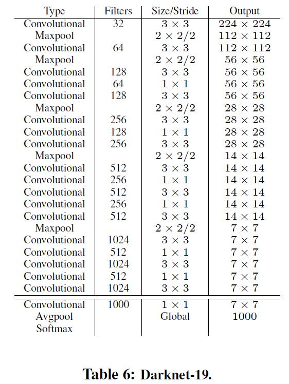

# YOLO9000: Better, Faster, Stronger
20140514

<!-- toc orderedList:0 depthFrom:1 depthTo:6 -->

* [YOLO9000: Better, Faster, Stronger](#yolo9000-better-faster-stronger)
  * [Shortcomeings of YOLO](#shortcomeings-of-yolo)
  * [improvements](#improvements)
    * [Better](#better)
    * [Faster](#faster)
    * [Stronger](#stronger)
  * [Reference](#reference)

<!-- tocstop -->

## Shortcomeings of YOLO
1.  Error analysis of YOLO compared to Fast R-CNN shows that YOLO makes a significant number of localization errors.
2. YOLO has relatively low recall compared to region proposal-based methods.

## improvements

### Better

1. BN on all of the convolutional layers in YOLO, we get more than 2% improvement in mAP. BN also help us remove dropout from the model without
overfitting.
2. increases the resolution to 448*448 for detection
3. We remove the fully connected layers from YOLO and use anchor boxes to predict bounding boxes.
4.Ddecouple the class prediction mechanism from the spatial location and
instead predict class and objectness for every anchor box.
4. Run k-means clustering on the training set bounding boxes to automatically find good priors.
5. To get a range of resolutions: simply adding a passthrough layer that brings features from an earlier layer at 26  26 resolution.
6. To learn to predict well across a variety of input dimensions：During tainning, every 10 batches our network randomly chooses a new image dimension size.

### Faster
1. darknet-19

2. training
   1. Classification：we use standard data augmentation tricks including random crops, rotations, and hue, saturation, and exposure shifts.
   2. Detection: removing the last convolutional layer and instead
adding on three 3x3 convolutional layers with 1024 filters each followed by a final 1x1 convolutional layer with the number of outputs we need for detection.

### Stronger
1. jointly training

## Reference
[15] -- hand-picked priors in Fast RCNN
