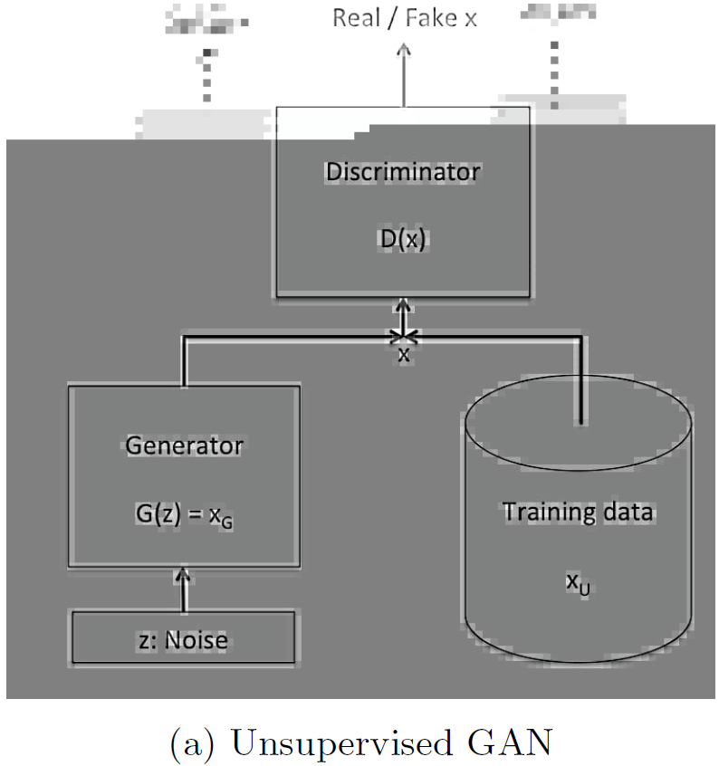
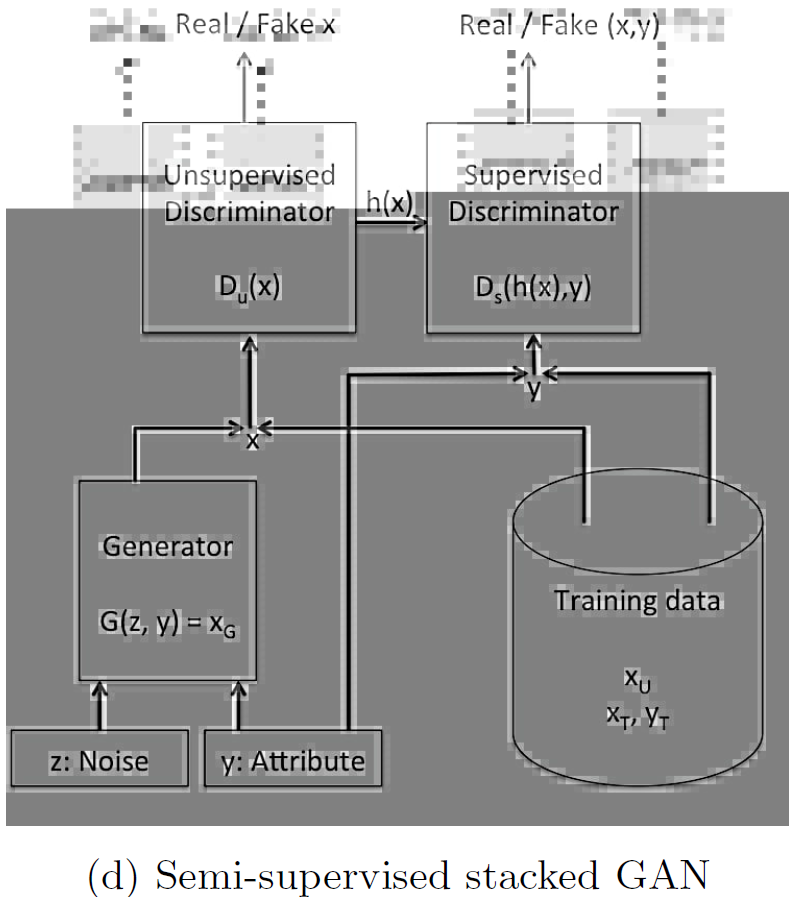

# Semi-supervised Conditional GANs
[arXiv](https://arxiv.org/abs/1708.05789)

1. The key difference between C-GAN and AC-GAN: instead of asking the discriminator to estimate the probability distribution of the attribute given the image as is the case in AC-GAN, C-GAN instead supplies discriminator Ds with both $(x; y)$ and asks it to estimate the probability that $(x; y)$ is consistent with the true joint distribution $p(x; y)$.
2. ssGAN: This model aims to extend the C-GAN architecture to the semi-supervised setting that can exploit the unlabeled data unlike SC-GAN,
