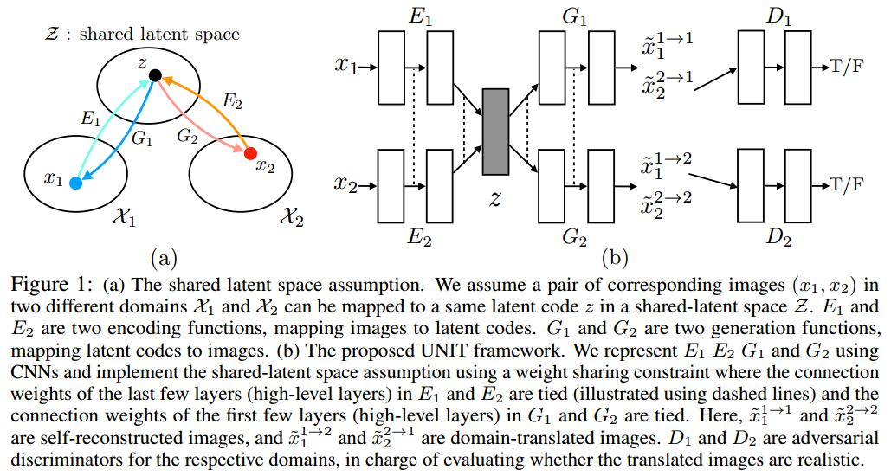

# Unsupervised Image-to-Image Translation Networks
[arXiv](https://arxiv.org/abs/1703.00848)
[github](https://github.com/mingyuliutw/unit)

## shared-latent space assumption 共享潜在空间假设

1. for any given pair of images $x_1$ and $x_2$, there exists a shared latent code $z$ in a shared-latent space, such that we can recover both images from this code, and we can compute this code from each of the two images.
> 对于一对image有一个共享的潜在的编码$z$，可以从$z$恢复两各image，$z$也可以从任一个image计算得到

$$
\begin{array}l
z=E_1(x_1)=E_2(x_2) \\
x1=G_1(z), x_2=G_2(z) \\
x_1 = G_1(E_2(x_2))
\end{array}
$$

2. shared-latent space assumption 包含了 cycle-consistency assumption

3. Assume a shared intermediate representation $h$, $z\to h\to x_1/x_2$

4. $G_1=G_{L,1}\circ G_H$
> $G_H$是高维生成器 $z\to h$
$G_{L,1}$是低维生成器$h\to x_1$

5. 一个例子，sunny and rainy image translation
   1. 高层表达--$z$：car in front, trees in back
   2. $z$的某一个实现(通过$G_H$)--$h$：car/tree occupy the following pixels
   3. 对每一个模态(sunny or rainy)，真实图像的生成方程--$G_{L,1},G_{L,2}$: tree is lush green in the sunny domain, but dark green in the rainy domain

## Framework
1. variational autoencoders (VAEs) + generative adversarial networks (GANs)
2. 6 subnetworks:
   1. two domain image encoders: $E_1,E_2$
   2. two domain image generators: $G_1,G_2$
   3. two domain adversarial discriminators: $D_1,D_2$
3. VAE:  
   1. VAE1 first maps $x_1$ to a code in a latent space $Z$ via the encoder $E_1$ and then decodes a random-perturbed version of the code to reconstruct the input image via the generator G1.
   > $x$通过$E$编码到潜在空间$Z$，这个编码(受随机扰动)再通过$G$重建$x$

   2. $z\in Z$是条件独立的高斯分布，方差为$1$
      1. $E$输出一个均值vector: $E_{\mu,1}(x_1)$
      2. $z_1$的分布表示为$q_1(z_1|x_1)=\mathcal N(z_1|E_{\mu,1}(x_1), I)$
      > $I$为单位阵

      3. 重建的图像表示为: $\widetilde x_1^{1\to1}=G_1(z_1\sim q_1(z_1|x_1))$
4. Weight-sharing
   1. share the weights of the last few layers of $E_1$ and $E_2$ that are responsible for extracting high-level representations of the input images in the two domains.
   2. share the weights of the first few layers of G1 and G2 responsible for decoding high-level representations for reconstructing the input images.
   > $E_1,E_2$共享后面几层参数，$G_1,G_2$共享前面几层参数

5. GAN
   1. reconstruction stream $\widetilde x_1^{1\to1}=G_1(z_1\sim q_1(z_1|x_1))$
   > can be supervisedly trained

   2. translation stream  $\widetilde x_2^{2\to1}=G_1(z_2\sim q_2(z_2|x_2))$
   > only apply adversarial training to images from the translation stream

6. Cycle-consistency (CC)
尽管 the shared-latent space assumption implies the cycle-consistency，还是用它来 further regularize the ill-posed unsupervised image-to-image translation problem

7. learning
   1. Overall objective  
   $$ \min_{E_1,E_2,G_1,G_2}\max_{D_1,D_2}\mathcal L_{VAE_1}(E_1,G_1)+ \mathcal L_{GAN_1}(E_1,G_1,D_1)+\mathcal L_{CC_1}(E_1,G_1,E_2,G_2)+ \mathcal L_{VAE_2}(E_2,G_2)+ \mathcal L_{GAN_2}(E_2,G_2,D_2)+\mathcal L_{CC_2}(E_2,G_2,E_1,G_1)
   $$
   2. VAE training aims for minimizing a variational upper bound In Overall objective  
   $$
   \mathcal L_{VAE_1}(E_1,G_1)=\lambda_1KL(q_1(z_1|x_1)||p_\eta(z)) - \lambda_2\mathbb E_{z_1\sim q_1(z_1|x_1)}(\log p_{G_1}(x_1|z_1))
   $$
   > 1. [KL divergence](https://blog.csdn.net/haolexiao/article/details/70142571) terms penalize deviation of the distribution of the latent code from the prior distribution
   > 2. The prior distribution is a zero mean Gaussian $p_\eta(z)=\mathcal N(z|0,I)$
   > 3. $P_G$ is Laplacian distributions; minimizing the negative log-likelihood term is equivalent to minimizing the absolute distance between the image and the reconstructed image. 等价于L1距离
   > [KL散度知乎介绍](https://zhuanlan.zhihu.com/p/37452654?utm_source=qq&utm_medium=social&utm_oi=638711330211762176): 是一种衡量两个分布（比如两条线）之间的匹配程度的方法

   3. GAN objective
   $$\mathcal L_{GAN_1}(E_1,G_1,D_1)=\lambda_0\mathbb E_{x_1\sim P_{\mathcal X_1}}[\log D_1(x_1)] + \lambda_0\mathbb E_{z_2\sim q_2(z_2|x_2)}[\log (1-D_1(G_1(z_2)))]$$
   > 只针对translation stream

   4. CC objective
   $$
   \mathcal L_{CC_1}(E_1,G_1,E_2,G_2)=\lambda_3KL(q_1(z_1|x_1)||p_\eta(z)) + \lambda_3KL(q_2(z_2|x^{1\to2}_1)||p_\eta(z)) -
   \lambda_4\mathbb E_{z_2\sim q_2(z_1|x^{1\to 2}_1)}(\log p_{G_1}(x_1|z_2))
   $$

   5. alternating gradient update scheme similar
   first apply a gradient ascent step to update $D_1,D_2$ with $E_1, E_2, G_1, G_2$ fixed. We then apply a gradient descent step to update $E_1, E_2, G_1, G_2$ with $D_1,D_2$ fixed.

## Learned
1. shared-latent space assumption
2. variational autoencoders + GANs
