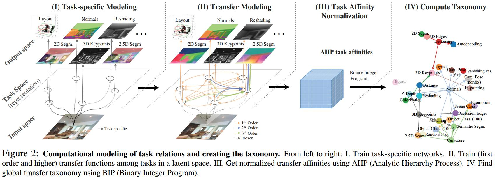

# Taskonomy: Disentangling Task Transfer Learning
Taskonomy = task taxonomy (分类学、分类法)
## Introduction
<<<<<<< HEAD
1. **Self-supervised learning** leverage the inherent relationships between tasks to learn a desired expensive one (e.g. object detection) via a cheap surrogate (e.g. colorization)
=======
1. **Self-supervised learning** leverage the inherent relationships between tasks to learn a desired expensive one (e.g. object detection) via a cheap surrogate (e.g. colorization)
>>>>>>> bb2b8d8fff03308190420d4f4476947be5fb198a
> 利用task内在的关系，通过一个简单的代替品来学习一个复杂的任务

2. **Unsupervised learning**  is concerned with the redundancies in the input domain and leveraging them for forming compact representations, which are usually agnostic to the downstream task
> 利用输入冗余来形成一个紧凑的表达，类似于downstream task

3. **Meta-learning** generally seeks performing the learning at a level higher than where conventional learning occurs
> 在更高的层次上学习

4. **Multi-task learning** targets developing systems that can provide multiple outputs for an input in one run
> 对于一个输出有多个输出

5. **Domain adaption** seeks to render a function that is developed on a certain domain applicable to another
> 在一个domian上学习的函数可以适用于其他domain

## Method
1. problem: maximize the collective performance on a set of tasks $\mathcal T=\{t_1,...,t_n\}$, subject to the constraint that we have a limited supervision budget $\gamma$
2. task dictionary: $\mathcal V=\mathcal T\cup\mathcal S$
> $\mathcal T$ 是目标任务, $\mathcal S$ 是训练任务, $\mathcal T-\mathcal T\cap\mathcal S$ 是target-only任务, $\mathcal S-\mathcal T\cap\mathcal S$ 是source-only任务

2. four step process

    1. a task-specific network for each task in $\mathcal S$ is trained
    2. all feasible transfers between sources and targets are trained
    > higher-order transfers: multiple inputs task to transfer to one target
    3. the task affinities acquired from transfer function performances are normalized
    4. we synthesize a hypergraph which can predict the performance of any transfer policy and optimize for the optimal one

### Step I: Task-Specific Modeling
train a fully supervised task-specific network for each task in $\mathcal S$ with encoder-decoder architecture
> 每一个task都有encoder和decoder

### Step II: Transfer Modeling

1. $t\in \mathcal T, s\in \mathcal S$, a transfer network learns a small readout function for $t$ given a statistic computed for $s$
2. 对一幅图像$I\in\mathcal D$的表达是$s$的encoder$E_s(I)$。 readout function $D_{s\to t}$ 有参数$\theta_{s\to t}$, 他需要最小化损失$L_t$
$$D_{s\to t}=\arg\min_\theta\mathbb E_{I\in\mathcal D}[L_t(D_\theta(E_s(I)),f_t(I))]$$
> $f_t(I)$是$t$任务、$I$图片的ground truth。$E_s(I)$可能不足以表达$t$任务，因此$D_{s\to t}$的performance可以作为任务相似度的度量(metric as task affinity)

### Step III: Ordinal Normalization using Analytic Hierarchy Process (AHP)
have an affinity matrix of transferabilities across tasks
> 找到任务之间的关系、相似性，每一对任务的关系用一个标量表示，组成一个矩阵

### Step IV: Computing the Global Taxonomy
devise a global transfer policy which maximizes collective performance across all tasks, while minimizing the used supervision.
> 找到最好的transfor的方式
