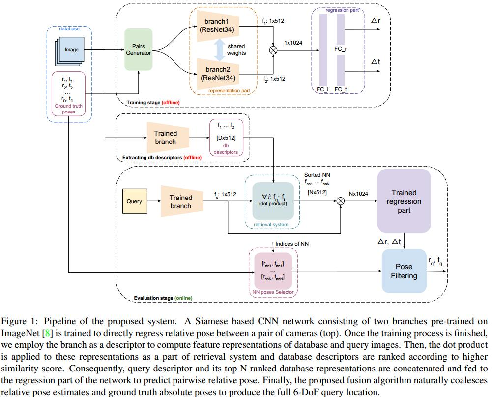

# Camera Relocalization by Computing Pairwise Relative Poses Using Convolutional Neural Network
[git](https://github.com/AaltoVision/camera-relocalisation)
[arXiv](https://arxiv.org/abs/1707.09733)
[iccv](http://openaccess.thecvf.com/content_ICCV_2017_workshops/papers/w17/Laskar_Camera_Relocalization_by_ICCV_2017_paper.pdf)

## Introduction
1. low-level process (SIFT, ORB, etc [2, 20, 27]) of finding matches does not work robustly and accurately in all scenarios, such as textureless scenes, large changes in illumination, occlusions and repetitive structures
2. scene coordinate regression forest (SCoRF) [32, 36] have been successfully applied to camera localization problem.
   1. predicted 3D location of four pixels
   2. refined by a RANSAC loop
   3. these methods require depth maps
3. CNN directly regresse the absolute camera pose
   1.  dependent on the coordinate frame of the training data belonging to a particular scene.
   2. limited scalability to large environments since

## Method

1. Siamese Net 学习图相对的相对pose
2. 训好的Siamese Net提取数据库（训练集）的特征
3. 给定一个query，先提特征，再从数据库中找最近的N和样本
4. 计算N个相对pose
5. fuse N个相对pose得到绝对pose
