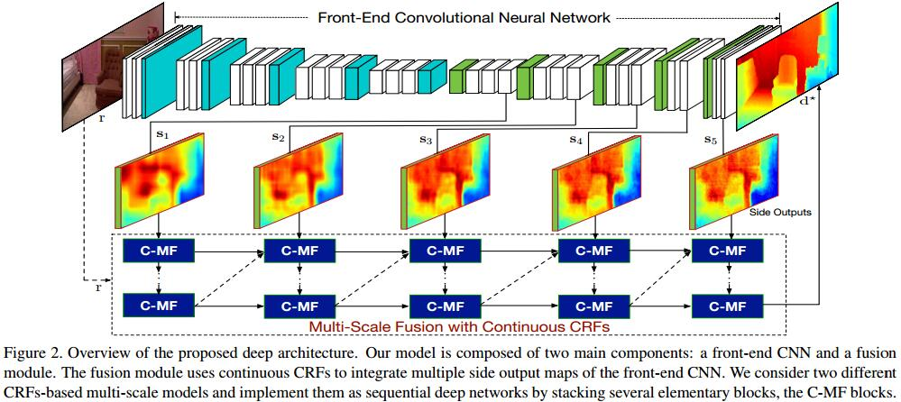
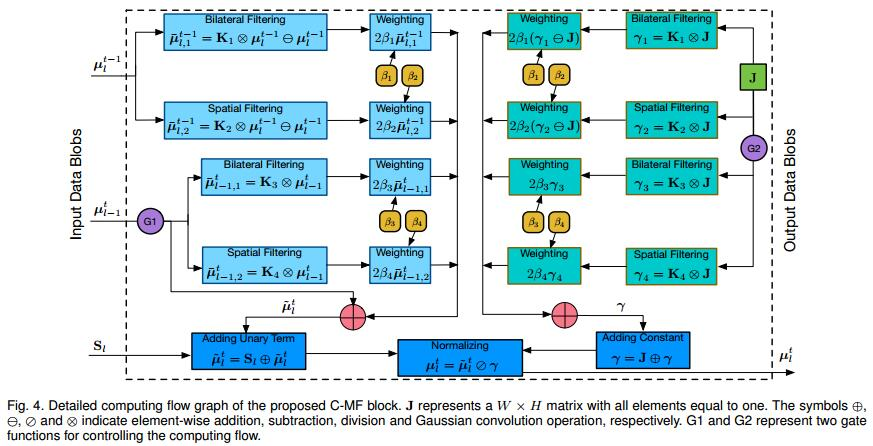
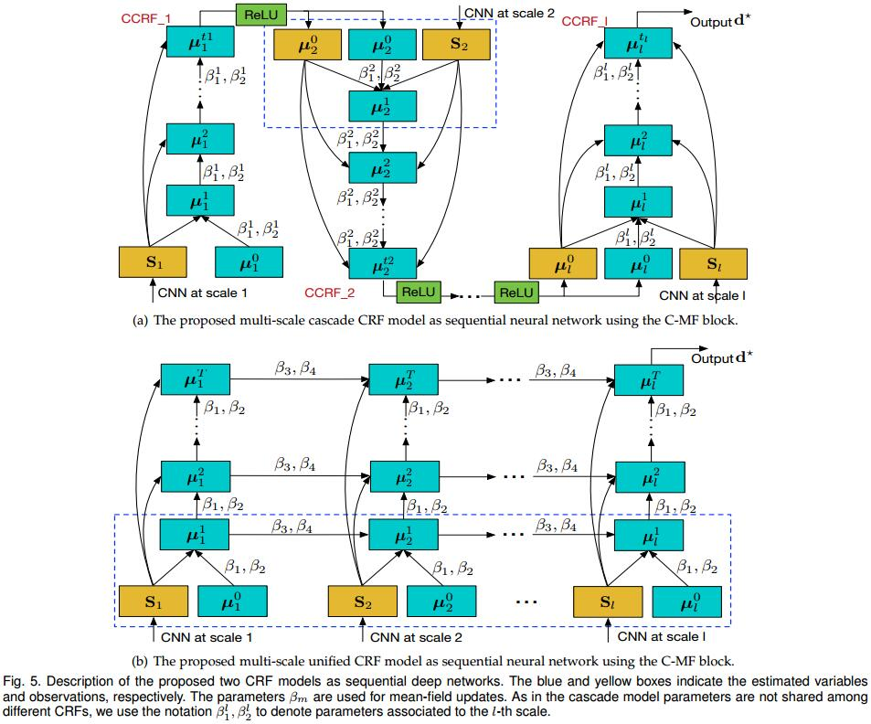

# Multi-Scale Continuous CRFs as Sequential Deep Networks for Monocular Depth Estimation
[arXiv](https://arxiv.org/abs/1704.02157)
[cvpr](http://openaccess.thecvf.com/content_cvpr_2017/papers/Xu_Multi-Scale_Continuous_CRFs_CVPR_2017_paper.pdf)
[PAMI](https://arxiv.org/abs/1803.00891)
[caffe](https://github.com/danxuhk/ContinuousCRF-CNN)

## Introduction
1. [21]: 把深度估计看做 a discrete-continuous CRF, 没有利用CNN.
2. [9]: 两个CNN，一个全局粗糙估计，一个局部改良

## Multi-Scale Models for Depth Estimation

### Problem Formulation and Overview
1. 从image space到depth space的映射$F:I\to D$
2. 训练集: $Q=\{(r_i,\bar d_i)\}_{i=1}^Q, r_i\in I, \bar d_i in D$
3. 多尺度front-end CNN: $L$个卷积层输出多尺度map $S=\{s_l\}_{l=1}^L, f_s(r;\Theta,\theta_l)\to s_l$
> $\Theta$为整个网络的参数，$\theta_l$为第$l$层的参数。CNN的多尺度中间层输出可表达为side output maps

4. fusion block: CRF整合CNN的输出
   1. single multi-scale CRFs: 整合多尺度的输出，平滑
   2. cascade of scale-specific CRFs: 在每一个尺度$l$，整合$s_l$，且输出作为下一个CRF的观测

### Fusing side outputs with continuous CRFs
1. Multi-Scale Unified CRF Model
   1. $LN$维的向量$\hat s=\{s_1,...,s_L\}$
   2. $LN$为的向量$d$为输出深度
   3. CRF可表示为一个条件概率
   $$P(d|\hat s)=\frac{1}{Z(\hat s)}\exp\{-E(d,\hat s)\}$$
   其中$z(\hat s)=\int_d\exp-E(d,\hat s)dd$
   4. E为能量函数
   $$E(d,\hat s)=\sum_{i=1}^N\sum_{l=1}^L\phi(d_i^l,\hat s)+\sum_{i,j}\sum_{l,k}\psi(d_i^l, d_j^k)$$
   其中$d_i^l$为第$l$尺度上第$i$个像素的hidden variable
   5. 二次unary terms
   $$ \phi(d_i^l,\hat s)=(d_i^l-s_i^l)^2 $$
   其中$s_i^l$为CNN的第$l$个尺度第$i$个像素的输出($d$为最终输出)
   6. pairwise potentials: 描述$d_i^l$和$d_j^k$的关系
   $$ \psi(d_i^l,d_j^k)=\sum_{m=1}^M\beta_mw_m(i,j,l,k,r)(d_i^l-d_j^k) $$
   其中$w$为权重，$r$为输入图像, $M$为核的数量
   7. mean-field approximation 用于inference
   $$\begin{array}l
   Q(d|\hat s)=\Pi_{i=1}^N\Pi_{l=1}^LQ_{i,l}(d_i^l|\hat s) \\[10pt]
   J_{i,l}=\log Q_{i,l}(d_i^l|\hat s)
   \end{array}
   $$
   8. mean-field updates
   $$\begin{array}l
   \gamma_{i,l}=2(1+2\sum_{m=1}^M\beta_m\sum_{k}\sum_{j,i}w_m(i,j,l,k,r))\\[10pt]
   \mu_{i,l}=\frac{2}{\gamma_{i,l}}(s_i^l+2\sum_{m=1}^M\beta_m\sum_{k}\sum_{j,i}w_m(i,j,l,k,r))
   \end{array}
   $$
   其中$\gamma_{i,l}, \mu_{i,l}$分别为$Q_{i,l}$的方差和均值
   9. $w$有如下假设
      1. 第$l$尺度的估计深度只与之前的尺度的估计有关
      2. 对于当前尺度和之前尺度的相关像素，$w$由$m$个高斯核定义 $$K_m^{i,j}=\exp(-\frac{||h_i^m-h_j^m||}{2\theta_m^2})$$
     其中$h^m$为对输出图像$r$提取的特征，$\theta$为超参数。该特征与DenseCRF一致

   10. 在以上假设下meanfield updates可以表示为
   $$\begin{array}l
   \gamma_{i,l}=2(1+2\sum_{m=1}^2\beta_m\sum_{j\neq i}K_m^{i,j}+2\sum_{m=3}^4\beta_m\sum_{j,i}K_m^{i,j}) \\[10pt]
   \mu_{i,l}=\frac{2}{\gamma_{i,l}}(s_i^l+2\sum_{m=1}^2\beta_m\sum_{j\neq i}K_m^{i,j}\mu_{j,l}+2\sum_{m=3}^4\beta_m\sum_{j,i}K_m^{i,j}\mu_{j,l-1})
   \end{array}$$
   其中$\beta_m$为可学习的参数
   11. 推理阶段，最大化log条件概率 $\widetilde d=\arg\max_d\log(Q(d|S)), \widetilde d=[\mu_{1,1},...,\mu_{N,L}]$, 以某一个尺度的输出$(\mu_{1,L},...,\mu_{N,L})$作为最终结果

2. Multi-Scale Cascade CRF Model
   1. $L$个CRF组成一个聚合，每个CRF关联一个尺度$l$，输出$d^l$。前一尺度的depth估计作为该尺度CRF的观测, i.e., $o^l=s^l+\widetilde d^{l-1}$
   2. 能量函数
   $$ E(d^l,o^l)=\sum_{i=1}^N\phi(d_i^l,o_i^l)+\sum_{i\neq j}\psi(d_i^l,d_j^l) $$
   3. 一元势函数反映观测$o_i^l$和$d_i^l$的相似性
   $$ \phi(d_i^l,o^l)=(d_i^l-o_i^l)^2 $$
   3. pairwise potentials促进临近的相似像素有相似的深度
   $$ \psi^{d_i^l,d_j^l}=\sum_{m=1}^M\beta_mK_m^{i,j}(d_i^l-d_j^l)^2 $$
   其中$M=2$类似于DenseCRF
   4. mean-field approximation
   $$\begin{array}l
   \gamma_{i,l}=2(1+2\sum_{m=1}^M\beta_m\sum_{j\neq i}K_m^{i,j}) \\[10pt]
   \mu_{i,l}=\frac{2}{\gamma_{i,l}}(o_i^l+2\sum_{m=1}^M\beta_m\sum_{j\neq i}K_m^{i,j}\mu_{i,l})
   \end{array}
   $$

## Multi-scale models as sequential deep networks

### C-MF: a Common CNN Implementation of Continuous Mean-Field Updating

1. 在对尺度CRF中，临近尺度的关系建模在一个hidden variable space中，在级联CRF中，前一尺度的估计作为observed variable
2. $S_l\in \mathbb R^{W\times H}$为$s_l$的矩阵形式，$\mu_l^t\in \mathbb R^{W\times H}$表示在第$l$尺度第$t$次迭代的输出深度。$\gamma\in \mathbb R^{W\times H}$为归一化矩阵
3. 在对尺度CRF中
   1. 用两个高斯核来卷积$\mu_l^{t-1}$和$\mu_{l-1}^{t}$，a spatial and a bilateral kernel。
   2. $\beta_m$是一个$1\times 1$的卷积
   3. 输出被加到$S_l$上
   4. $\gamma$也被看做高斯核的卷积，而不是CRFasRNN中的softmax
4. 级联的CRF中
   1. $\mu_{l-1}^t$作为 observed variable
   2. 为了设计满足两种CRF模型的C-MF，引入门$G_1,G_2$, 1为对尺度CRF，0为级联CRF
5. 两种参数
   1. bandwidth $\theta_m$ 预先设定
   2. 权重$\beta_m$ 可学习

### From Mean-Field Updates to Sequential Deep Networks

1. ReLU有两个作用
   1. 深度估计应始终为正
   2. 增加非线性建模能力

### Optimization of The Whole Network
1. 两阶段训练
   1. 训基础网络$\Theta$和side-output分支$\theta=\{\theta\}^L_{l=1}$
   $$ \{\Theta^* ,\theta^* \}=\arg\min\sum_{l=1}^L\sum_{i\in trainset}||f_s(r_i;\Theta,\theta_l)- d^{gt}_i||_ 2^2 $$
   2. fine-tune with CRF
   $$\{\Theta^* ,\theta^* ,\beta^* \}=\arg\min\sum_{i\in trainset}||F(r_i,\Theta,\theta,\beta)-d^{gt}_i||$$

c
C
c
c
c
c
c
code
c
c
c
