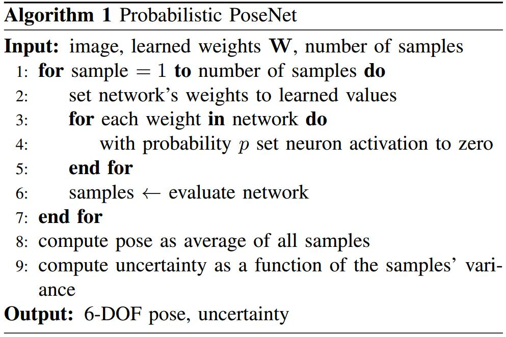

# Modelling Uncertainty in Deep Learning for Camera Relocalization
[arXiv](https://arxiv.org/abs/1509.05909)

## Introduction
1. SLAM没有被wide spread use in the wild 的原因是
   1. 不能处理大的视角或者场景变化 inability to cope with large viewpoint or appearance changes.
   2. visual SLAM [1,4,5,9] 的地标(point landmarks, e.g., SIFT or ORB)不能对变化的场景产生鲁棒的表达 not able to create a representation which is sufficiently robust to these challenging scenarios.
   3. Dense SLAM systems [4], [5] 也不能处理好以上两个问题
   4. metric SLAM 需要一个好的初始pose
2. PoseNet的优点
   1. 整合了 appearance based relocalization 和 metric pose estimation
   2. 不需要store key frames或establish frame to frame correspondence
   3. 直接从图像回归full 6-DOF camera pose，不需要跟踪或者地标匹配(landmark matching)

##  Modelling Localization Uncertainty
1. consider sampling with dropout as a way of getting samples from the posterior distribution of models.
2. Bayesian convolutional neural network [24]
   1. 从data$X$和标签$Y$中，找到卷积参数$W$的后验分布 $p(W|X,Y)$ finding the posterior distribution over the convolutional weights, $W$, given our observed training data $X$ and labels $Y$.
   2. 这个后验分布很难获得(is not tractable)，所以需要用学习的方法去近似
   3. 使用variational inference[21]来近似，通过最小化KL散度来近似网络的权重 learn the distribution over the network’s weights, $q(W)$, by minimising the Kullback-Leibler (KL) divergence between this approximating distribution and full posterior
   $$KL(q(W)||p(W|X,Y))$$
   4. 近似的variational distribution $q(W_i)$ (i为网络层的索引)为
   $$\begin{array}l
   b_{i,j}\sim Bernoulli(p_i) \quad  j=1,...,K_{i-1} \\
   W_i = M_i diag(b_i)
   \end{array}
   $$
   > $b_i$为Bernoulli分布的随机变量，$M_i$为variational parameters

3. 最小化Euclidean loss objective function 对于最小化 the Kullback-Leibler divergence term是有效的。因此，网络的训练过程会促使模型学习到一种分布能表达数据且防止过拟合。
4. 以上是从Bayesian convolutional neural networks的角度解释dropout。dropout应被加在网络的每一层后面。
5.

6. 实际上，add dropout after inception (sub-net) layer 9 and after the fully connected layers in the pose regressor.
