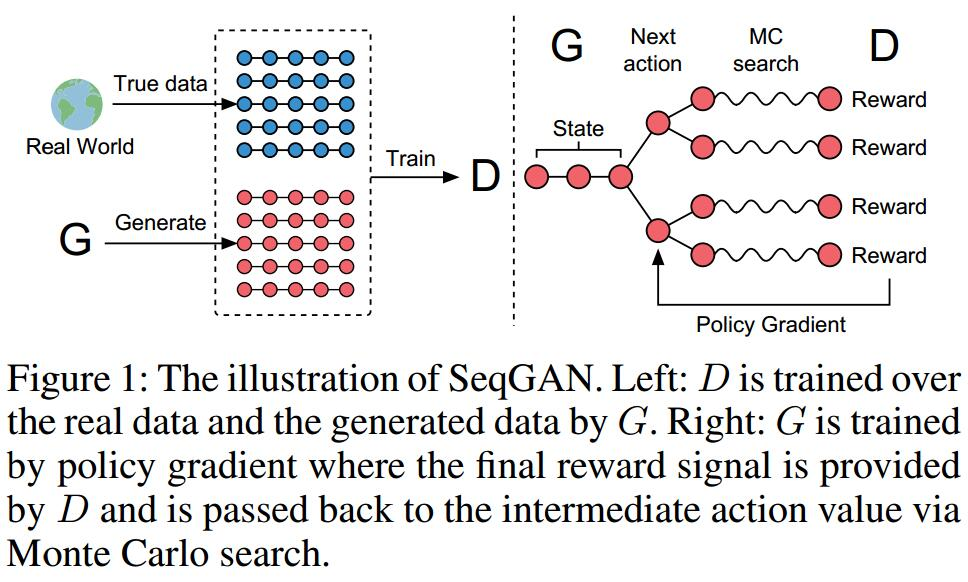
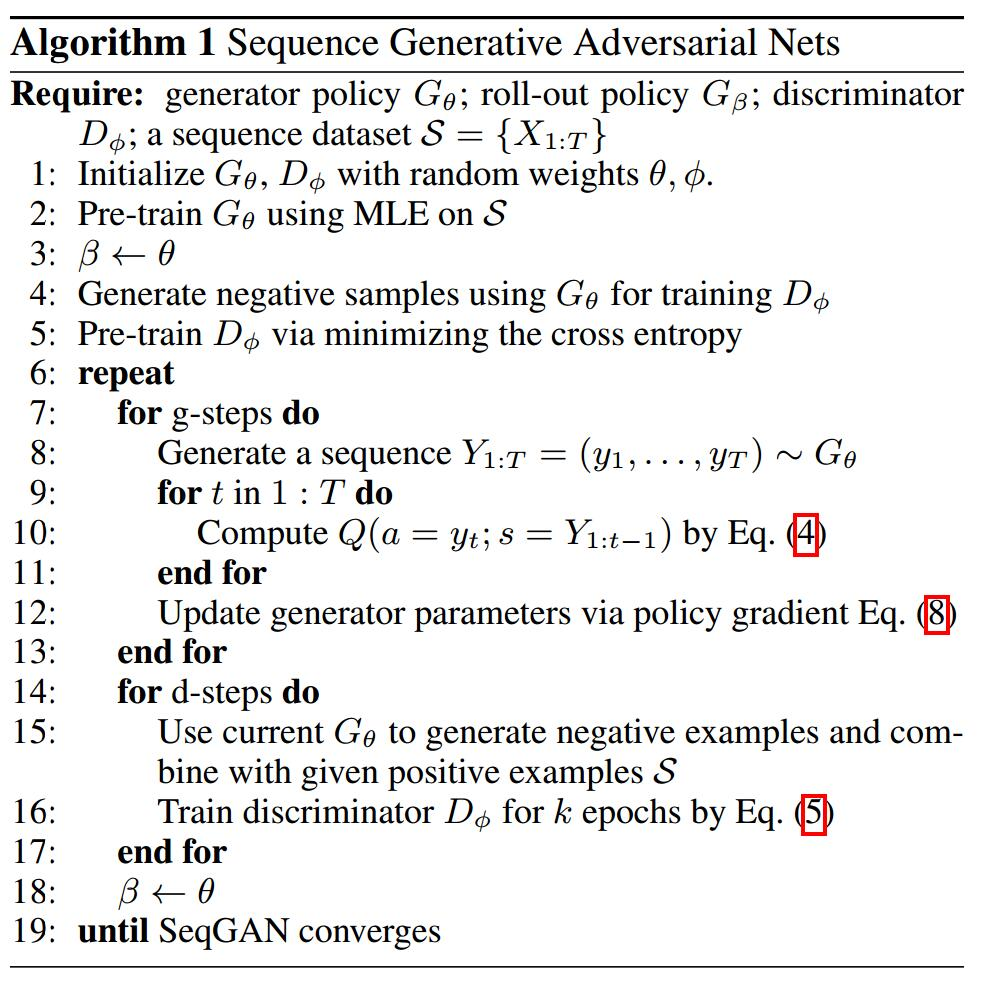

# SeqGAN: Sequence Generative Adversarial Nets with Policy Gradient
[arXiv](https://arxiv.org/abs/1609.05473)
[ppt](http://lantaoyu.com/files/2017-02-07-aaai-seqgan.pdf)

## Introduction
1. applying GAN to generating sequences
has two problems
   1.  GAN is designed for generating real-valued, continuous data but has difficulties in directly generating sequences of discrete tokens, such as texts
   2. GAN can only give the score/loss for an entire sequence when it has been generated
   > 1.难生成离散的符号，2.只有生成序列完成后才能计算loss

2. This paper
   1. sequence generation -> sequential decision making process
   2. G -> an agent of reinforcement learning (stochastic parametrized policy)
     1. state: generated tokens so far
     2. action: the next token to be generated
   3. reward signal is provided by D at the end of each episode via Monte Carlo approach

## Sequence Generative Adversarial Nets
1. policy model
$$ G_\theta(y_t|Y_{1:t-1}) $$
> $y$为生成的符号，$Y$为序列，$t$为时间，$\theta$为参数

2. probability model (indicating how likely a sequence $Y_{1:T}$ is from real sequence data or not)
$$D_\phi(Y_{1:T})$$

3. SeqGAN via Policy Gradient

    1. objective function
    $$
    \begin{array}l
    J(\theta)=\mathbb E[R_T|s_0,\theta]=\sum_{y_1\in\mathcal Y}G_{\theta}(y_1|s_0)\cdot Q_{D_\phi}^{G_\theta}(s_0,y_1) \\
    Q_{D_\phi}^{G_\theta}(a=y_T,s=Y_{1:T-1})=D_\phi(Y_{1:T})
    \end{array}
    $$
    > $Q_{D_\phi}^{G_\theta}(s,a)$为值函数，表示在策略$G_\theta$下，在状态$s$，采取动作$a$的期望累积reward

    2. applying Monte Carlo search with a roll-out policy $G_\beta$ to sample the unknown last $T-t$ tokens (to evaluate the action-value for an intermediate state)
    > D只能在序列生成后给出reward，但是在每一个时间步，需要考虑未来利益最大化，于是用MC和当前策略$G_\beta$(就是当前的$G$)来采样剩余的N个未知的符号

    $$
    \begin{array}l
    \{Y^1_{1:T},...,Y^N_{1:T}\}=MC^{G_\beta}(Y_{1:t};N) \\
    Y^n_{1:t}=(y1,...,y_t) \\
    Y^n_{t+1:T} \text{is sampled}
    \end{array}
    $$

    3. we run the roll-out policy starting from current state till the end of the sequence for N times to get a batch of output samples.
    > 采样直到序列结束，得到一个完整的output, 对每一个时间步都有reward产生

    $$\begin{array}l Q_{D_\phi}^{G_\theta}(s=Y_{1:t-1},a=y_t)= \\
    \frac{1}{N}\sum_{n=1}^ND_\phi(Y_{1:T}^n), Y_{1:T}^n\in MC^{G_\beta}(Y_{1:t};N)\quad \text{for} \quad t<T \\
    D_\phi(Y_{1:t})\quad \text{for} \quad t=T
    \end{array} $$
    
