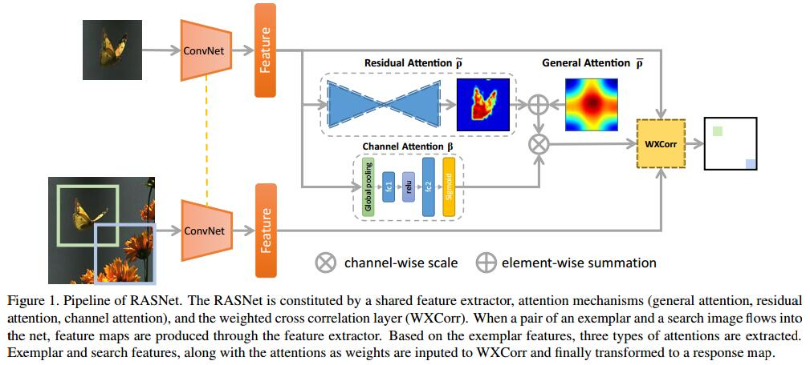
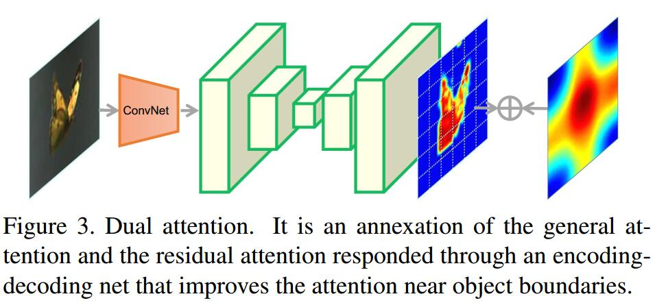

# Learning Attentions: Residual Attentional Siamese Network for High Performance Online Visual Tracking
[paper](http://www.dcs.bbk.ac.uk/~sjmaybank/CVPR18RASTrackCameraV3.3.pdf)
[github](https://github.com/foolwood/RASNet)

## Dual Attention

1. a **general attention** superimposed by **a residual attention**
$$ \rho=\overline\rho + \widetilde\rho $$
2. The general part $\overline\rho$ encodes a generality learning from all training samples
3. residual part $\widetilde\rho$ describes the distinctiveness between the live tracking target and the learnt common model

## Channel Attention
1. The channel attention net is composed by a dimension reduction layer with reduction ratio $r$ (set to 4), a ReLU, and then a dimension increasing layer with a sigmoid activation.
2. input: a $d$ channel feature $Z=[z_1,z_2,...,z_d],z_i\in R^{W\times H}$
3. output: $\widetilde Z=[\widetilde z_1,...,\widetilde z_d, \widetilde z_i\in R^{W\times H}]$
$$ \widetilde z_i=\beta_i\cdot z_i $$
