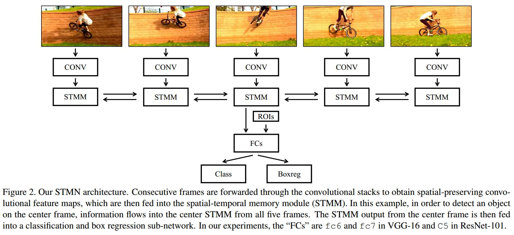
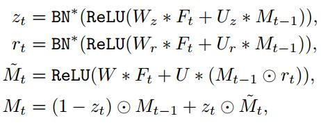

# Spatial-Temporal Memory Networks for Video Object Detection
[arXiv](https://arxiv.org/abs/1712.06317)
[TOC]
## Architecture

> 也用到前后的信息

## ConvGRU

1. $BN^* $ 有归一化的作用 it normalizes its input to $[0, 1]$, instead of zero mean and unit standard deviation
2. 全用 Relu函数
3. 用最后一层Conv(静态的feature map)初始化$W$

## MatchTrans 记忆关联
$$
\begin{array}l
\Gamma_{x,y}(i,j)=\frac{F_t(x,y)\cdot F_{t-1}(x+i,y+i)}{\sum_{i,j\in\{-k,k\}} F_t(x,y)\cdot F_{t-1}(x+i,y+i)} \\
M'_{t-1}(x,y)=\sum_{i,j\in\{-k,k\}}\Gamma_{x,y}(i,j)\cdot M_{t-1}(x+i,y+i)
\end{array}
$$
> $t$: 时间，$F$: feature map，$M$: 记忆，ConvGRU的 state。选定一个$(2k+1)\times (2k+1)$的领域(matching vicinity)。计算某个像素点$(x,y)$在这个领域内与迁移帧的相关性。加权计算$M'$,保留相关性强的特征。
这种做法类似光流位置传播，但计算量小

* 显著性特征图计算
computing the L2 norm across feature channels at each spatial location to get a saliency map
