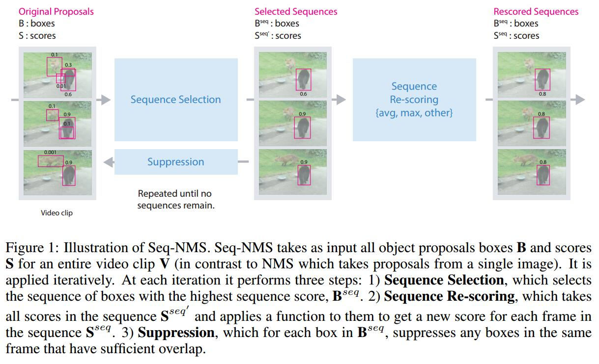
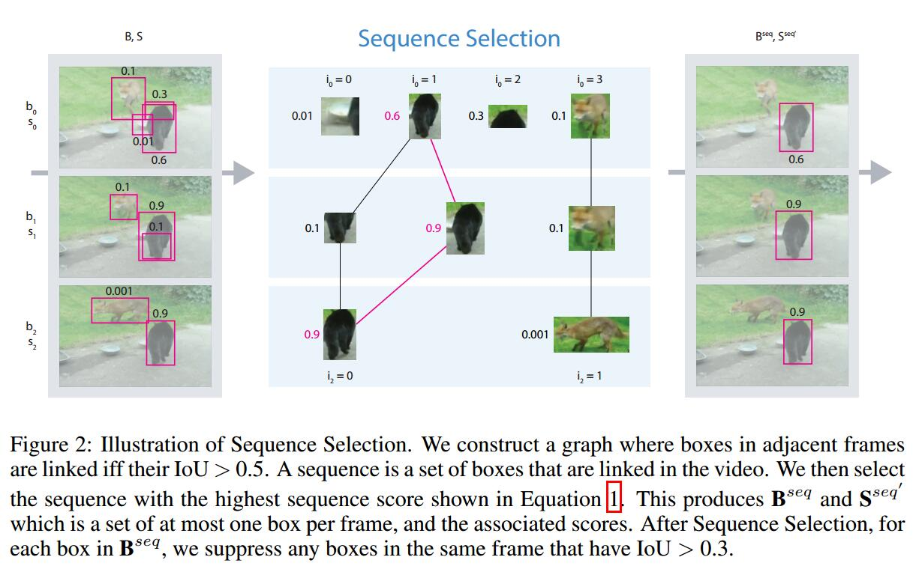

# Seq-NMS for Video Object Detection
[arXiv](https://arxiv.org/abs/1602.08465)
[TOC]
## Introduction
1. difficulty:
   1. drastic scale changes
   2. occlusion
   3. motion blur

## Contributions
1. Seq-NMS: the post-processing phase to use high-scoring object detections
from nearby frames in order to boost scores of weaker detections within the same clip
> Seq-NMS: 后处理过程，用临近帧的信息提升检测结果

## Seq-NMS

### Sequence Selection
find the maximum score sequence across the entire clip

### Sequence Re-scoring
$S^{seq} = F(S^{seq'})$. We try two different re-scoring functions: the average and the max
### Suppression
The boxes in the sequence are then removed from the set of boxes we link over.
Furthermore, we apply suppression within frames such that if a bounding box in frame $t$; $t\in[t_s; t_e]$, has an IoU with bt over some threshold, it is also removed from the set of candidate boxes.
