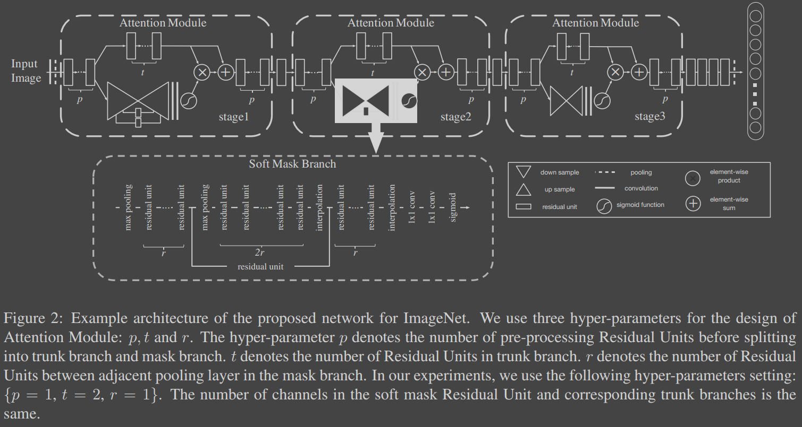

# Residual Attention Network for Image Classification
[arXiv](https://arxiv.org/abs/1704.06904)

## introduction

越high-level的part feature及其mask越会focus在object或者parts of object上。而且通过mask，可以diminish不相关的区域，如背景。

## Method

1. Attention Residual
$$
H_{i,c}(x)=(1+M_{i,c}(x))* F_{i,c}(x)
$$
>$i$ ranges over all spatial positions and $c\in (1,\cdots,C)$ is the index of the channel. 三维的attention map，与原feature map点乘

2. Spatial Attention and Channel Attention
   1. Mixed attention: use simple sigmoid for each channel and spatial position
   $$ f_1(x_{i,c})=\frac{1}{1+\exp(-x_{i,c})} $$
   2. Channel attention: performs L2 normalization within all channels for each spatial position to remove spatial information.
   $$ f_2(x_{i,c})=\frac{x_{i,c}}{||x_i||} $$
   3. Spatial attention: performs normalization within feature map from each channel and then sigmoid to get soft mask related to spatial information only
   $$ f_3(x_{i,c})=\frac{1}{1+\exp(-(x_{i,c}-mean_c)/std_c)} $$

## Reference
### Attention LSTM
[18] J.-H. Kim, S.-W. Lee, D. Kwak, M.-O. Heo, J. Kim, J.-W. Ha, and B.-T. Zhang. Multimodal residual learning for visual qa. In Advances in Neural Information Processing Systems, pages 361–369, 2016.  
[21] H. Larochelle and G. E. Hinton. Learning to combine foveal glimpses with a third-order boltzmann machine. In NIPS, 2010.
[25] H. Noh, S. Hong, and B. Han. Learning deconvolution network for semantic segmentation. In ICCV, 2015.
[29] R. K. Srivastava, K. Greff, and J. Schmidhuber. Training very deep networks. In NIPS, 2015.
